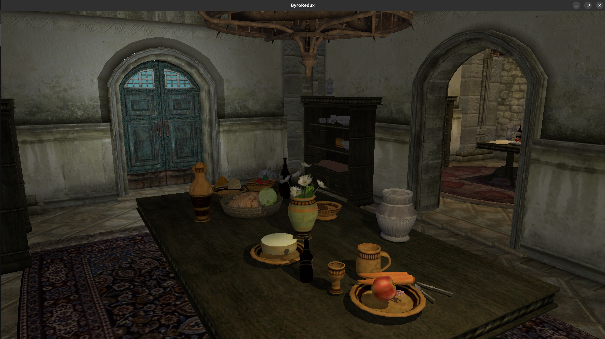
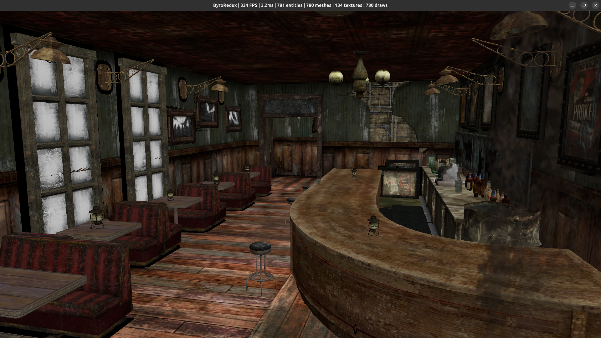

# ByroRedux

A clean Rust + Vulkan rebuild of the Gamebryo / Creation engine lineage
(Oblivion → Starfield). Linux-first. Not a port — a ground-up rebuild
that understands the legacy architecture and builds modern equivalents.


*Anvil Heinrich Oaken Halls loaded directly from `Oblivion.esm` + meshes + textures BSAs — RT multi-light with ray-query shadows.*


*Prospector Saloon (Goodsprings) from `FalloutNV.esm` — 1 200 entities,
streaming RIS shadows, 192.8 FPS / 5.19 ms on RTX 4070 Ti (commit e6e8091,
wall-clock `--bench-frames 300`; see [ROADMAP Project Stats](ROADMAP.md#project-stats)).*

## At a glance

| | |
|-|-|
| **Games supported** | 7 — Oblivion · Fallout 3 · Fallout New Vegas · Skyrim SE · Fallout 4 · Fallout 76 · Starfield |
| **NIF parse rate** | **100%** across **177 286** files — every supported game, full mesh archive |
| **Archive formats** | BSA v103 / v104 / v105 · BA2 v1 / v2 / v3 / v7 / v8 (GNRL + DX10, zlib + LZ4) |
| **NIF block types** | ~186 registered — 156 parsed + 30 Havok skip |
| **ESM records (FNV)** | 62 219 structured records — items, NPCs, factions, cells, CREA, LVLC, SCPT, PACK, QUST, DIAL, MESG, PERK, SPEL, MGEF, … |
| **Tests passing** | 1 150+ across 16 workspace crates |
| **Source code** | ~98 K lines of Rust across 200+ source files |
| **Renderer** | Vulkan 1.3 + `VK_KHR_ray_query` — multi-light RT shadows, reflections, 1-bounce GI, SVGF temporal denoiser, TAA, streaming RIS (8 reservoirs/fragment), BLAS compaction + LRU eviction |
| **Physics** | Rapier3D — collision import from NIF `bhk` chain, dynamic bodies, fixed 60 Hz substep |
| **Scripting** | Papyrus `.psc` lexer + Pratt expression parser + full AST; ECS-native event + timer runtime |
| **UI** | Scaleform / SWF menus via Ruffle (offscreen wgpu → Vulkan texture overlay) |

## Highlights

- **Full RT lighting pipeline** — ray-query shadows with streaming weighted
  reservoir sampling (8 reservoirs / fragment, unbiased weight clamped at
  64×), RT reflections with roughness-driven jitter, 1-bounce GI with
  cosine-weighted hemisphere sampling, SVGF temporal denoiser with
  motion-vector reprojection and mesh-id disocclusion, TAA with Halton(2,3)
  jitter and YCoCg variance clamp, ACES tone mapping.
- **100% parse coverage** across all seven supported Bethesda titles —
  177 286 NIFs validated end-to-end. CI fails on any single-file
  regression (per-game `MIN_SUCCESS_RATE = 1.0`).
- **Full asset round-trip** from unmodified Bethesda game data —
  `Oblivion.esm` + BSA → rendered interior with XCLL lighting +
  per-mesh NiLight torches + RT shadows, no loose files required.
- **BLAS lifecycle done right** — batched builds (single GPU submission
  per cell load), `ALLOW_COMPACTION` + query-based compact copy (20–50%
  memory reduction), LRU eviction with VRAM/3 budget, TLAS frustum
  culling, TLAS refit when layout is unchanged.
- **Pipeline cache threaded through every create site** with disk
  persistence — 10–50 ms cold shader compile → <1 ms warm.
  SPIR-V reflection cross-checks every descriptor-set layout against
  shader declarations at pipeline-create time.
- **Debug CLI** (`byro-dbg`) with live ECS inspection over TCP, Papyrus
  expression query language (`42.Transform.translation.x`,
  `find("TorchSconce01")`, `entities(LightSource)`), screenshot
  capture. Zero per-frame cost when no debugger is connected.
- **Clean-room legacy reference** — parses `nif.xml` (niftools
  authoritative spec) and the Gamebryo 2.3 source tree for byte-exact
  serialization. No proprietary bits linked — just data understood.

## State

Interior cells load and render end-to-end from unmodified Bethesda game
data (Oblivion, Fallout 3, Fallout New Vegas). Full RT pipeline
operational. Skyrim SE loads individual meshes; cell loader wiring is
tracked as M32.5. FO4 architecture records parse; cell wiring same.
No skinned rendering yet (M29), no sky / atmosphere yet (M33), no
world streaming yet (M40) — see **[ROADMAP.md](ROADMAP.md)** for the
authoritative capability matrix, active milestones, and architecture
decisions. Session narratives live in **[HISTORY.md](HISTORY.md)**.

## Run

```bash
# FNV interior with full lighting
cargo run --release -- --esm FalloutNV.esm --cell GSProspectorSaloonInterior \
             --bsa "Fallout - Meshes.bsa" \
             --textures-bsa "Fallout - Textures.bsa" \
             --textures-bsa "Fallout - Textures2.bsa"

# Oblivion interior
cargo run --release -- --esm Oblivion.esm --cell AnvilHeinrichOakenHallsHouse \
             --bsa "Oblivion - Meshes.bsa" \
             --textures-bsa "Oblivion - Textures - Compressed.bsa"

# Skyrim SE mesh + textures
cargo run -- --bsa "Skyrim - Meshes0.bsa" \
             --mesh "meshes\clutter\ingredients\sweetroll01.nif" \
             --textures-bsa "Skyrim - Textures3.bsa"

# Loose NIF + optional animation
cargo run -- path/to/mesh.nif [--kf path/to/anim.kf]

# Per-game NIF parse-rate sweep (requires game data)
cargo test -p byroredux-nif --release --test parse_real_nifs -- --ignored

# Debug CLI — connect to a running engine (TCP, port 9876)
cargo run -p byro-dbg
```

**Controls**: Escape captures mouse, WASD + mouse flies, Space/Shift
raise/lower, Ctrl for speed boost.

## Build

- Rust stable (2021 edition)
- Vulkan SDK or drivers with validation layers
- `glslangValidator` for shader compilation
- C++17 compiler (for the cxx bridge)
- Linux (primary target)

## Per-game data paths

Integration tests resolve game data via environment variables, falling
back to canonical Steam install paths:

```
BYROREDUX_OBLIVION_DATA   .../Oblivion/Data
BYROREDUX_FO3_DATA        .../Fallout 3 goty/Data
BYROREDUX_FNV_DATA        .../Fallout New Vegas/Data
BYROREDUX_SKYRIMSE_DATA   .../Skyrim Special Edition/Data
BYROREDUX_FO4_DATA        .../Fallout 4/Data
BYROREDUX_FO76_DATA       .../Fallout76/Data
BYROREDUX_STARFIELD_DATA  .../Starfield/Data
```

## Documentation

- [ROADMAP.md](ROADMAP.md) — current state, active milestones, architecture decisions
- [HISTORY.md](HISTORY.md) — session narratives (2026-04 audit closeouts, etc.)
- [docs/engine/](docs/engine/) — architecture, renderer, NIF parser, ECS, physics, debug CLI
- [docs/legacy/](docs/legacy/) — Gamebryo 2.3 architecture reference, Papyrus API, Creation Engine UI

## Acknowledgements

- [**nifxml**](https://github.com/niftools/nifxml) — the NifTools project's
  machine-readable NIF format specification. ByroRedux's NIF parser is
  written directly against nifxml's block definitions, version gates, and
  field conditions. Without that community reverse-engineering effort,
  supporting seven Gamebryo/Creation-era games would not be tractable.
- [**Ruffle**](https://ruffle.rs) — the open-source Flash Player emulator.
  ByroRedux's UI layer embeds Ruffle to render the Scaleform/SWF menus
  Bethesda shipped with every Creation Engine title.

## License

MIT
