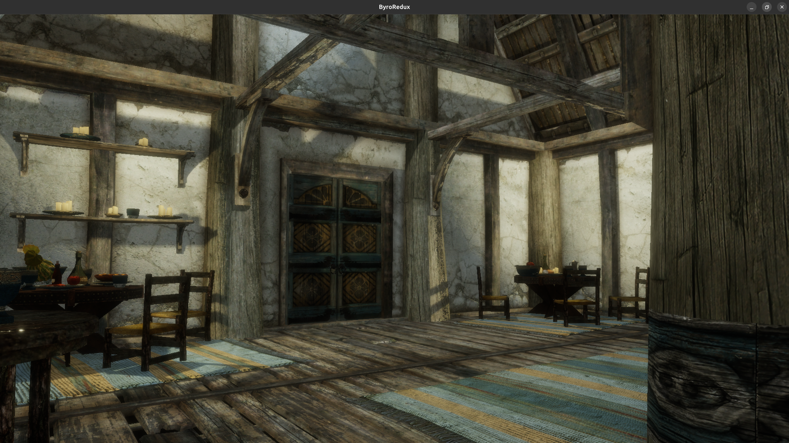

# ByroRedux

A clean Rust + Vulkan rebuild of the Gamebryo / Creation engine lineage
(Oblivion → Starfield). Linux-first. Not a port — a ground-up rebuild
that understands the legacy architecture and builds modern equivalents.


*The Bannered Mare in Whiterun, loaded from `Skyrim.esm` + BSAs — RT multi-light on, though a few lighting glitches remain.*


*Anvil Heinrich Oaken Halls loaded directly from `Oblivion.esm` + meshes + textures BSAs — RT multi-light with ray-query shadows.*


*Prospector Saloon (Goodsprings) from `FalloutNV.esm` — streaming RIS
shadows on RTX 4070 Ti. Current entity count + bench numbers in
[ROADMAP Project Stats](ROADMAP.md#project-stats) (refreshed per
`/session-close`).*

## At a glance

| | |
|-|-|
| **Games supported** | 7 — Oblivion · Fallout 3 · Fallout New Vegas · Skyrim SE · Fallout 4 · Fallout 76 · Starfield |
| **NIF parse rate** | **100% clean** on FO3 / FNV / Skyrim SE; 95–99% clean / 100% recoverable on Oblivion / FO4 / FO76 / Starfield — 184 886 files validated. See [ROADMAP compatibility matrix](ROADMAP.md#compatibility-matrix). |
| **Archive formats** | BSA v103 / v104 / v105 · BA2 v1 / v2 / v3 / v7 / v8 (GNRL + DX10, zlib + LZ4) |
| **NIF block types** | See `crates/nif/src/blocks/mod.rs` for the canonical dispatch registry (incl. Havok skip-stubs) |
| **ESM records (FNV)** | ~25 structured types (items, NPCs, factions, cells, CREA, LVLC, SCPT, PACK, QUST, DIAL, MESG, PERK, SPEL, MGEF, …) plus a separate long-tail bucket (sounds / idle / grasses / debris). See [ROADMAP Status](ROADMAP.md#status) for the current count — it's tracked by a floor-based integration test, not a number pinned here. |
| **Cross-game translation** | **NIFAL** (NIF Abstraction Layer) — one explicit `translate()` boundary per data category resolves each game's native NIF into a single canonical, game-agnostic representation; no per-game branches downstream. See [docs/engine/nifal.md](docs/engine/nifal.md). |
| **Test count, LOC, file count, workspace size** | See [ROADMAP Project Stats](ROADMAP.md#project-stats) — refreshed per `/session-close` so the README doesn't drift behind. |
| **Renderer** | Vulkan 1.3 + `VK_KHR_ray_query` — multi-light RT shadows, reflections, 1-bounce GI, SVGF temporal denoiser, TAA, streaming RIS (8 reservoirs/fragment), BLAS compaction + LRU eviction, Disney/Burley BSDF lobe for PBR (BGSM/BGEM + Starfield) content |
| **Physics** | Rapier3D — collision import from NIF `bhk` chain, dynamic bodies, fixed 60 Hz substep |
| **Scripting** | Papyrus `.psc` parser (full AST) + `.pex` bytecode decompiler; recognizer-driven attach of compiled vanilla scripts at cell load; ECS-native event + timer runtime |
| **UI** | Scaleform / SWF menus via Ruffle (offscreen wgpu → Vulkan texture overlay) |

## Start here

ByroRedux is currently a source-built engine project, not a packaged game or
launcher. It does not redistribute Bethesda game data.

- **New user:** follow [Getting Started](docs/getting-started.md) for a first
  build, test run, real-content launch, and troubleshooting.
- **Contributor:** continue with [Contributing](docs/contributing.md) for the
  development loop, CI checks, and project conventions.
- **Engine developer:** use the [engine documentation index](docs/engine/index.md)
  and its recommended reading order.
- **Checking capability or direction:** use the [feature matrix](docs/feature-matrix.md)
  and authoritative [roadmap](ROADMAP.md).

## Highlights

- **Full RT lighting pipeline** — ray-query shadows with streaming weighted
  reservoir sampling (8 reservoirs / fragment, unbiased weight clamped at
  64×), RT reflections with roughness-driven jitter, 1-bounce GI with
  cosine-weighted hemisphere sampling, SVGF temporal denoiser with
  motion-vector reprojection and mesh-id disocclusion, TAA with Halton(2,3)
  jitter and YCoCg variance clamp, ACES tone mapping. PBR surfaces shade
  through a Disney/Burley BSDF lobe (anisotropic GGX, Burley retro-reflective
  diffuse) gated on `MAT_FLAG_PBR_BSDF` for BGSM/BGEM + Starfield material
  content; classic Gamebryo content keeps the legacy lobe.
- **NIFAL — one canonical translation tier** — every supported engine version
  (Oblivion → Starfield) decodes its native NIF into raw per-game `Imported*`
  structs, then a single explicit `translate()` boundary per data category
  resolves them into one canonical, fully-resolved representation the ECS /
  renderer / gameplay consume identically. Materials are the converged
  reference slice (`metalness`/`roughness` plain `f32`, glass classified once,
  the two duplicate construction sites collapsed into
  `byroredux/src/material_translate.rs`); geometry, skinning, lights, and
  collision are likewise canonical, with particle emitter base params and
  authored birth-rate / size folded in this session. See
  [docs/engine/nifal.md](docs/engine/nifal.md).
- **100% parse coverage** across all seven supported Bethesda titles —
  100% clean on FO3 / FNV / Skyrim SE and 95–99% clean / 100% recoverable
  on Oblivion / FO4 / FO76 / Starfield (184 886 NIFs validated). CI fails
  on regression (per-game per-block-type baselines).
- **Full asset round-trip** from unmodified Bethesda game data —
  `Oblivion.esm` + BSA → rendered interior with XCLL lighting +
  per-mesh NiLight torches + RT shadows, no loose files required.
- **BLAS lifecycle done right** — batched builds (single GPU submission
  per cell load), `ALLOW_COMPACTION` + query-based compact copy (20–50%
  memory reduction), LRU eviction with VRAM/3 budget, TLAS frustum
  culling, TLAS refit when layout is unchanged.
- **Pipeline cache threaded through every create site** with disk
  persistence — 10–50 ms cold shader compile → <1 ms warm.
  SPIR-V reflection cross-checks every descriptor-set layout against
  shader declarations at pipeline-create time.
- **Debug CLI** (`byro-dbg`) with live ECS inspection over TCP, Papyrus
  expression query language (`42.Transform.translation.x`,
  `find("TorchSconce01")`, `entities(LightSource)`), screenshot
  capture. Zero per-frame cost when no debugger is connected.
- **Clean-room legacy reference** — parses `nif.xml` (niftools
  authoritative spec) and the Gamebryo 2.3 source tree for byte-exact
  serialization. No proprietary bits linked — just data understood.

## Why ByroRedux exists

Gamebryo and its descendant Creation Engine power some of the most modded, most replayed RPGs ever shipped --- Oblivion, the Fallout 3D era, Skyrim, Starfield. Twenty-plus years of community work has built ecosystems around them that no other game engine can claim. But the engines themselves have aged in ways their players know intimately: 32-bit memory ceilings retrofitted into 64-bit address spaces, single-threaded game loops bolted onto modern CPUs, renderer paths layered on top of paths layered on top of fixed-function assumptions from 2002. The result is engines that ship great games but require workarounds, community patches, and engine extenders to remain playable on current hardware.

ByroRedux is a ground-up reimplementation that treats the legacy data as authoritative and the legacy code as documentation. Same NIFs, same BSAs, same ESM/ESP records, same Papyrus scripts --- but parsed, validated, and rendered by a modern Rust + Vulkan stack designed from day one around the constraints the originals couldn't anticipate: GPU raytracing, multi-core scheduling, deterministic resource lifetimes, automated regression testing across every supported game.

The project is FOSS-only by design. No proprietary dependencies, no closed-source middleware, no licensed binaries. Vulkan instead of DirectX, Rapier3D instead of Havok, Ruffle instead of Scaleform, the niftools community spec instead of reverse-engineered binary patches. Every component is auditable, replaceable, and outlives any single vendor. That matters because the originals don't have that property --- Bethesda's modding community has spent two decades reverse-engineering things that should never have been opaque in the first place.

The goal is not a replacement for the original engines. The goal is a reference implementation: a place where the architecture is legible, the data formats are documented in working code, and the next twenty years of community modding has a foundation that won't decay with each Windows update.

## State

Interior cells load and render end-to-end across six games — Oblivion
(Anvil Heinrich Oaken Halls), FO3 (Megaton, 929 REFRs), FNV (Prospector
Saloon), Skyrim SE (Whiterun Bannered Mare), FO4 (MedTekResearch01),
and Starfield (Cydonia, 93 547 entities + 91 698 static colliders —
Session 42 bring-up via #1289 / #1291 / #1292 / #1294).
Per-cell entity counts and bench numbers live in [ROADMAP Project
Stats](ROADMAP.md#project-stats), refreshed per `/session-close`.
Full RT pipeline + sky/atmosphere + exterior sun operational. Skinning
chain verified end-to-end (M29 closed) with GPU bone-palette compute
pass + persistent SSBO slot pool (M29.5 / M29.6, Session 40). World
streaming (M40, closed) — multi-cell grid loads and follows the player
via an async pre-parse worker, with LRU BLAS eviction/reload as cells
stream out; interior↔exterior cell swaps trigger via the `door.teleport`
console command. See
[docs/engine/exterior-grid-streaming.md](docs/engine/exterior-grid-streaming.md).
Kinematic character controller (M28.5)
replaces fly-cam-only on-foot movement — gravity + collide-and-slide +
jump, walk/fly toggle on `F`. NPC spawning (M41) shipped Phase 1
(T-pose humanoid + skeleton + body + hands + head + FaceGen morphs) and
Phase 2 close-out (`Inventory` / `EquipmentSlots` ECS + ARMO/ARMA/LVLI
dispatch + worn-mesh resolver). FO4 humanoid armor meshes pending a
Havok `.hkx` skeleton stub (M41.x); the ECS equip state is observable
today via `inspect <ref>` in `byro-dbg`. Oblivion exterior gated on
TES4 worldspace + LAND wiring. See **[ROADMAP.md](ROADMAP.md)** for the
authoritative capability matrix, active milestones, and architecture
decisions. Session narratives live in **[HISTORY.md](HISTORY.md)**.

## Run

```bash
# FNV interior with full lighting (Textures2.bsa picked up automatically — see note below)
cargo run --release -- --esm FalloutNV.esm --cell GSProspectorSaloonInterior \
             --bsa "Fallout - Meshes.bsa" \
             --textures-bsa "Fallout - Textures.bsa"

# Oblivion interior
cargo run --release -- --esm Oblivion.esm --cell AnvilHeinrichOakenHallsHouse \
             --bsa "Oblivion - Meshes.bsa" \
             --textures-bsa "Oblivion - Textures - Compressed.bsa"

# Skyrim SE mesh + textures (Meshes0/1 are already numeric — list each
# explicitly; Textures0…4 likewise if more than one is needed)
cargo run -- --bsa "Skyrim - Meshes0.bsa" \
             --mesh "meshes\clutter\ingredients\sweetroll01.nif" \
             --textures-bsa "Skyrim - Textures3.bsa"

# Skyrim interior with compiled-script behavior (M47.2). --scripts-bsa
# points at the archive holding the .pex bytecode (Skyrim - Misc.bsa,
# Fallout4 - Misc.ba2, …); the cell loader decompiles each scripted
# REFR's VMAD-named .pex and attaches its recognized ECS behavior.
cargo run -- --esm Skyrim.esm --cell <editor_id> \
             --bsa "Skyrim - Meshes0.bsa" \
             --textures-bsa "Skyrim - Textures0.bsa" \
             --scripts-bsa "Skyrim - Misc.bsa"

# Loose NIF + optional animation
cargo run -- path/to/mesh.nif [--kf path/to/anim.kf]

# Per-game NIF parse-rate sweep (requires game data)
cargo test -p byroredux-nif --release --test parse_real_nifs -- --ignored

# Debug CLI — connect to a running engine (TCP, port 9876)
cargo run -p byro-dbg
```

**Controls**: Escape captures mouse, WASD + mouse moves, Space/Shift
raise/lower (fly mode) or jump (walk mode), Ctrl for speed boost. Press
`F` to toggle walk ↔ fly. Walk mode is the M28.5 kinematic capsule
(gravity + collide-and-slide + autostep); fly mode keeps the legacy
no-clip cam.

**Sibling archive auto-load.** When `--bsa` / `--textures-bsa` points
at an unsuffixed `.bsa` / `.ba2` (e.g. `Fallout - Textures.bsa`), the
loader also opens `<stem>2.bsa` … `<stem>9.bsa` next to it on disk.
That covers FNV/FO3's split textures (`Textures.bsa` +
`Textures2.bsa`) without a second flag. Skyrim's already-numeric
`Skyrim - Meshes0.bsa` / `Meshes1.bsa` is inert under this rule —
list each archive explicitly.

**Diagnostics.** `BYROREDUX_RENDER_DEBUG` enables fragment-shader
bypass / viz bits for ad-hoc bisection: `0x4` outputs world-space
normal, `0x8` colors fragments by tangent presence (green = authored
or synthesized tangent reaches Path 1, red = screen-space derivative
fallback), `0x10` skips normal-map perturbation entirely. See
[docs/engine/debug-cli.md](docs/engine/debug-cli.md) for the full bit
catalog and the `tex.missing` triage flow that closed the
"chrome walls" diagnosis.

## Build

- Rust stable (2021 edition)
- Vulkan SDK or drivers with validation layers
- `glslangValidator` for shader compilation
- C++17 compiler (for the cxx bridge)
- Linux (primary target)

## Per-game data paths

Integration tests resolve game data via environment variables, falling
back to canonical Steam install paths:

```
BYROREDUX_OBLIVION_DATA   .../Oblivion/Data
BYROREDUX_FO3_DATA        .../Fallout 3 goty/Data
BYROREDUX_FNV_DATA        .../Fallout New Vegas/Data
BYROREDUX_SKYRIMSE_DATA   .../Skyrim Special Edition/Data
BYROREDUX_FO4_DATA        .../Fallout 4/Data
BYROREDUX_FO76_DATA       .../Fallout76/Data
BYROREDUX_STARFIELD_DATA  .../Starfield/Data
```

## Documentation

- [docs/getting-started.md](docs/getting-started.md) — first build, first run, debug attach, troubleshooting
- [docs/contributing.md](docs/contributing.md) — build, test, run; start here to get hacking
- [ROADMAP.md](ROADMAP.md) — current state, active milestones, architecture decisions
- [HISTORY.md](HISTORY.md) — session narratives (2026-04 audit closeouts, Session 42 Starfield bring-up, etc.)
- [docs/engine/nifal.md](docs/engine/nifal.md) — NIFAL canonical translation tier (three-tier model, per-category leak inventory)
- [docs/engine/material-abstraction.md](docs/engine/material-abstraction.md) — the material slice that NIFAL generalises (canonical `Material`, glass/PBR resolved at parse)
- [docs/engine/](docs/engine/) — architecture, renderer, NIF parser, ECS, physics, debug CLI
- [docs/legacy/](docs/legacy/) — Gamebryo 2.3 architecture reference, Papyrus API, Creation Engine UI

## Acknowledgements

- [**nifxml**](https://github.com/niftools/nifxml) — the NifTools project's
  machine-readable NIF format specification. ByroRedux's NIF parser is
  written directly against nifxml's block definitions, version gates, and
  field conditions. Without that community reverse-engineering effort,
  supporting seven Gamebryo/Creation-era games would not be tractable.
- [**xEdit / TES5Edit**](https://github.com/TES5Edit/TES5Edit) — ElminsterAU
  and the xEdit team's record-definition database (`wbDefinitions*.pas`) is
  ByroRedux's authoritative reference for the binary layout of ESM/ESP
  records across the lineage: NPC_ SPECIAL/perk storage (`PRPS`/`DNAM`/`PRKR`),
  the per-game CTDA condition-function index tables (e.g. FNV `GetActorValue`
  14, `GetReputation` 573), and `REPU`/faction structures. Definitions read
  from the `dev-4.1.6` branch; no code is copied — only the documented format
  knowledge. Without two decades of that reverse-engineering effort, parsing
  Bethesda's plugin formats correctly would not be tractable.
- [**The Fallout Wiki (Nukapedia)**](https://fallout.fandom.com) — the
  community's encyclopedia of Fallout game mechanics. ByroRedux's character
  and combat layers are built against its documented per-game values: the
  derived-stat formulas behind the CHARAL character layer (e.g. FNV Action Points
  `65 + 3·Agility` capped at 95, FO3 `65 + 2·Agility` capped at 85,
  FO4 `60 + 10·Agility`), the V.A.T.S. ruleset (95% hit cap, per-game crit
  bonus, AP costs), and the FNV combat-damage chain. Pages are read via the
  MediaWiki `api.php` (raw wikitext); content is CC BY-SA — only documented
  facts and numeric values inform the engine, no article text is reproduced.
- [**GECKwiki**](https://geckwiki.com) — the community reference for the
  Creation Kit / GECK and Gamebryo engine internals. ByroRedux's accuracy
  model draws on its Fallout: New Vegas *Gun Spread Formula* and the
  `fSpread*` / `fVATS*` game settings with their defaults (e.g.
  `fVATSMaxChance` 95, `fWobbleToSkillConversion` 0.5, `fMinGunSpreadValue`
  0.01). Used as documented format/behavior knowledge only — no code copied.
- [**The Elder Scrolls Wiki**](https://elderscrolls.fandom.com) — the
  community's encyclopedia of Elder Scrolls game mechanics, and the TES-side
  counterpart to the Fallout Wiki for the CHARAL character layer. ByroRedux's
  TES rule family is built against its documented values: Skyrim's base
  100 Health/Magicka/Stamina with the +10-per-level pick, and Oblivion's
  eight-attribute system with skill-governed level-up modifiers (+1…+5).
  Read via the MediaWiki `api.php`; content is CC BY-SA — only documented
  facts and numeric values inform the engine, no article text is reproduced.
- [**Ruffle**](https://ruffle.rs) — the open-source Flash Player emulator.
  ByroRedux's UI layer embeds Ruffle to render the Scaleform/SWF menus
  Bethesda shipped with every Creation Engine title.
- [**OpenMW**](https://gitlab.com/OpenMW/openmw) — the open-source
  reimplementation of Morrowind that runs the full legacy-Gamebryo
  pipeline (Morrowind / Oblivion / FO3 / FNV / Skyrim LE) correctly.
  ByroRedux's understanding of the legacy `NiSkinData` skinning
  convention — specifically the role of `NiSkinData::mTransform` (the
  global skin transform) which NifSkope's partition path silently
  drops — comes from reading OpenMW's NIF skinning evaluator at
  `components/sceneutil/riggeometry.cpp` and the loader at
  `components/nifosg/nifloader.cpp`. OpenMW is GPLv3; we use it as a
  reference only — no code is copied. See M41.0 Phase 1b.x research
  in [byroredux/tests/skinning_e2e.rs](byroredux/tests/skinning_e2e.rs)
  for the specific findings.
- [**GLSL-PathTracer**](https://github.com/knightcrawler25/GLSL-PathTracer)
  — the open-source GLSL path tracer (MIT License, Copyright (c) 2019
  Asif Ali) whose single-Disney-BSDF shader is ByroRedux's reference
  implementation for the PBR lighting lobe. The anisotropic GGX
  (Trowbridge-Reitz) distribution, the Burley retro-reflective diffuse +
  Hanrahan-Krueger fake-subsurface split, and the F0-from-IOR derivation
  in [`triangle.frag`](crates/renderer/shaders/triangle.frag) are adapted
  from its `src/shaders/common/disney.glsl` / `pathtrace.glsl` (cited
  inline at each adapted function). Used under the MIT License; its
  copyright notice is reproduced here and in the shader header.
- The **Disney "principled" BRDF** — the shading *model* those lobes
  implement — is Brent Burley and Walt Disney Animation Studios,
  [*"Physically Based Shading at Disney"*](https://disneyanimation.com/publications/physically-based-shading-at-disney/),
  part of the SIGGRAPH 2012 course *Practical Physically-Based Shading in
  Film and Game Production*. ByroRedux implements the model from the
  published course notes; **no Disney code or assets are used.**

## License

MIT.

Third-party code that ByroRedux adapts is credited in
[Acknowledgements](#acknowledgements). Notably, the Disney-BSDF shading
lobe in [`triangle.frag`](crates/renderer/shaders/triangle.frag) is
adapted from knightcrawler25/GLSL-PathTracer (MIT, Copyright (c) 2019 Asif
Ali); the BRDF model it implements is Brent Burley / Walt Disney Animation
Studios' published "Physically Based Shading at Disney" (SIGGRAPH 2012) —
model only, no Disney code or assets.

## Contributors

In order of first contribution:

- [**Matias Zanolli**](https://github.com/matiaszanolli) — creator and primary maintainer
- [**Jah-yee**](https://github.com/Jah-yee) — docs fix
- [**Dodothereal**](https://github.com/Dodothereal) — FO4 legacy shader-type gating fix
