# FSR 3.1 upscaler integration plan

Status: **Phase 0 complete; Phase 1 awaiting approval. No renderer implementation has started.**

Date: 2026-07-21

Scope: replace the default temporal antialiasing path with AMD FidelityFX Super
Resolution 3.1 in upscaler-only mode. Keep the existing TAA implementation as an
explicit runtime fallback until FSR has passed the validation gates below. Frame
generation is out of scope and must not be built, linked, initialized, or
dispatched.

## Phase 0: exploration findings

### 0.1 Current TAA implementation

The complete implementation is split between
[`taa.rs`](../../crates/renderer/src/vulkan/taa.rs),
[`taa.comp`](../../crates/renderer/shaders/taa.comp), camera setup in
[`draw.rs`](../../crates/renderer/src/vulkan/context/draw.rs), and the main
geometry shaders
[`triangle.vert`](../../crates/renderer/shaders/triangle.vert) and
[`triangle.frag`](../../crates/renderer/shaders/triangle.frag).

`TaaPipeline` owns two `R16G16B16A16_SFLOAT` history/output images, one per
frame-in-flight. They remain in `GENERAL`, are both storage outputs and sampled
history, and use the opposite frame slot as previous history. Its descriptor
inputs are:

| Binding role | Producer | Resolution |
| --- | --- | --- |
| Current linear HDR | Main render-pass HDR attachment | Swapchain extent |
| Motion | G-buffer `R16G16_SFLOAT` | Swapchain extent |
| Current and previous mesh ID | Per-frame G-buffer `R32_UINT` slots | Swapchain extent |
| Current and previous octahedral normal | Per-frame G-buffer `R16G16_SNORM` slots | Swapchain extent |
| Previous TAA history | Other TAA slot | Swapchain extent |
| TAA output/history | Current TAA slot | Swapchain extent |
| Parameters | Per-frame host-visible UBO | N/A |

The compute shader performs the following resolve:

1. Use a five-tap motion/mesh-ID search to select a reprojection vector from a
   stable surface.
2. Reproject with `previous_uv = current_uv - motion`.
3. Reject off-screen samples, background, mismatched mesh IDs, alpha-blended
   pixels (mesh-ID bit 31), and previous normals whose octahedral-decoded dot
   product is below `0.85`.
4. Build a 3x3 YCoCg neighborhood, variance-clip history with gamma `1.5`, and
   sample history with a nine-tap Catmull-Rom filter.
5. Blend bounded history with a fixed current-frame alpha of `0.1`, modified by
   luminance difference, and preserve the current HDR alpha.

The first frame and every explicit reset use current color only. A global
`frames_since_creation` state controls that window. Creation or dispatch failure
falls back to raw HDR and permanently disables camera jitter for that session;
resize recreates both history images, rewrites descriptors, and clears the
failure latch.

The TAA lifecycle and all consumers/feeders are:

- Construction in [`context/mod.rs`](../../crates/renderer/src/vulkan/context/mod.rs)
  after the G-buffer and composite HDR images exist. On success, the composite
  HDR descriptor is rebound from raw HDR to TAA output.
- Per-frame parameter upload in `draw.rs` before the main-pass host-to-GPU
  barrier.
- Dispatch in
  [`post_passes.rs`](../../crates/renderer/src/vulkan/context/post_passes.rs),
  after SVGF, caustics, and volumetrics and before SSAO, bloom, and composite.
- Completion is marked only after successful queue submission so an
  unsubmitted command buffer cannot advance history.
- Resize in
  [`resize.rs`](../../crates/renderer/src/vulkan/context/resize.rs), followed by
  rebinding the new TAA output views to the composite pipeline.
- Destruction with the Vulkan context.
- `signal_temporal_discontinuity` pairs a TAA history reset with the existing
  SVGF recovery window. Callers include cell loads/unloads, save loads,
  interior/exterior transitions, debug scene loads, camera cuts, and resize.
- The only downstream consumer of resolved TAA is composite binding 0. Bloom
  currently reads the **raw pre-TAA HDR** image instead.

FSR must replace this resolve, not wrap it. In FSR mode none of the TAA history,
oct-normal validation, neighborhood clamp, or TAA blend may run. The
oct-normal/mesh-ID validation inside SVGF is independent and remains at render
resolution.

### 0.2 Current frame graph

The current renderer does not have a standalone path-tracing pass. ReSTIR-DI,
ray-query shadows/reflections, and the indirect sample are produced inline by
the main fragment shader. The actual order is:

```mermaid
flowchart LR
    A[Camera upload and TAA jitter] --> B[Skinning / BLAS refit / TLAS]
    B --> C[Cluster cull]
    C --> D[Main render pass at swapchain extent]
    D --> D1[Opaque and alpha-blended geometry\ninline ReSTIR/ray queries]
    D1 --> D2[Water]
    D2 --> D3[Scaleform/Ruffle UI in HDR]
    D3 --> E[Depth history copy]
    E --> F[SVGF temporal + atrous]
    F --> G[Caustic splat]
    G --> H[Volumetric inject/integrate]
    H --> I[TAA resolve]
    I --> J[SSAO for next frame]
    J --> K[Bloom from raw pre-TAA HDR]
    K --> L[Composite + sky + indirect + volume + bloom\nexposure + ACES + underwater]
    L --> M[egui]
    M --> N[Present / screenshot]
```



Important consequences:

- Geometry, transparency, water, Scaleform UI, all G-buffer attachments, SVGF,
  SSAO, bloom, caustics, and the TAA history are tied to swapchain resolution.
- The main pass writes direct HDR and G-buffer data. SVGF denoises only the raw
  indirect term; final indirect lighting is added later by composite.
- Alpha-blended geometry is already in direct HDR before SVGF and TAA. Water
  writes HDR but not coherent depth, motion, normal, or mesh ID.
- Scaleform/Ruffle UI is temporally filtered. Only egui is composed after TAA.
- SSAO is sampled by main geometry and computed after that geometry, so its
  result is effectively consumed on the next frame even though a nearby comment
  calls it current-frame.
- Bloom and TAA see different versions of scene color.

### 0.3 Motion-vector and jitter contracts

#### Existing motion convention

The camera UBO stores unjittered current and previous view-projection matrices.
`triangle.vert` computes current and previous clip positions from those
unjittered matrices, then applies the current jitter only to `gl_Position`.
`triangle.frag` stores:

```text
motion = 0.5 * (current_ndc - previous_ndc)
previous_uv = current_uv - motion
```

The stored `R16G16_SFLOAT` value is therefore **current-minus-previous in
normalized UV space**, not pixels, and excludes projection jitter. Both current
TAA and SVGF consume this convention.

FSR expects a vector from the current pixel to that pixel's previous-frame
position: **previous-minus-current in screen-pixel space**. The least invasive
and safest adapter is to retain the engine convention for SVGF and supply FSR
with:

```text
motionVectorScale = (-render_width, -render_height)
```

No FSR motion-vector jitter-cancellation flag will be set because the source
motion excludes jitter. Unit tests and a debug reprojection view must prove this
sign, scale, and Y convention before visual integration proceeds.

There is one blocking correctness issue exposed by this audit: skinned meshes
use prior bone transforms, but rigid instances currently use the current model
matrix for both current and previous clip positions. Moving rigid objects
therefore lack object motion. Correct previous-instance transforms are an
isolated prerequisite commit, not an FSR heuristic.

Opaque and alpha-tested triangles write motion. Alpha-blended triangles may
overwrite auxiliary targets without coherent depth, while water and particles
do not provide a complete depth/motion footprint. Stable alpha-blended objects
should write motion where possible, but reactive and transparency/composition
masks remain mandatory.

#### Existing jitter

Current TAA uses a hard-coded 16-sample Halton(2,3) sequence:

```text
index = frame_counter % 16 + 1
jitter_ndc = ((halton2 - 0.5) * 2 / width,
              (halton3 - 0.5) * 2 / height)
```

It is deterministic, but its phase count does not vary with the upscale ratio.
There is a separate 32-sample Halton(5,7) lens/aperture sequence for the current
stochastic depth-of-field path.

FSR mode will query the decoupled API for its Halton(2,3) phase count and pixel
offset, derived from render/output resolution. ByroRedux uses a Vulkan
Y-flipped projection, so the queried unit-pixel offset will be uploaded as:

```text
jitter_ndc = ( 2 * jitter_x / render_width,
              -2 * jitter_y / render_height)
```

The exact queried pixel offset is also passed unchanged in the FSR dispatch.
The sequence index resets deterministically with FSR history. The TAA fallback
retains its existing sequence.

Stochastic lens jitter will be disabled during the initial FSR validation gate.
It may be re-enabled only after proving the combined reprojection contract, or
moved to an output-resolution post-upscale depth-of-field pass. Silently mixing
an unreported lens jitter into FSR's expected projection jitter is not allowed.

### 0.4 Render-target sizing

There is no current render/output resolution separation. The following are all
created from `swapchain_state.extent` and recreated on swapchain resize:

- Main HDR and depth, framebuffers, viewport, and scissor.
- Normal, motion, mesh-ID, raw-indirect, and albedo G-buffer images.
- SVGF histories and atrous outputs, ReSTIR reservoirs, caustics, water
  caustics, SSAO, bloom, and TAA.
- Composite resources and output framebuffers.

Volumetrics are the exception: their froxel grid is fixed at `160 x 90 x 128`.
The current HDR image lacks storage usage; FSR needs a separate output-resolution
HDR image with at least storage and sampled usage. Bindless texture samplers have
no configured mip LOD bias, so their effective bias is zero today.

### 0.5 Tests, image-quality coverage, and benchmarks

Existing relevant coverage is narrow:

- `taa.rs` has tests for first-frame reset, warm history state, and shader-source
  checks for bounded history/surface rejection.
- `draw.rs` tests only jitter enable/disable/failure gating and that an enabled
  jitter is nonzero.
- GPU instance/shader layout tests check prior-bone motion and render-origin
  handling, mostly through shader-source contracts. There are no numerical
  current-to-previous motion convention tests.
- [`golden_frames.rs`](../../byroredux/tests/golden_frames.rs) contains one
  ignored 1280x720 cube-demo golden test with per-pixel tolerances. It has no
  SSIM metric, preset matrix, motion stress, transparent content, or real scene
  coverage.
- [`renderer-eval.sh`](../../scripts/renderer-eval.sh) captures Cornell frames
  1/8/32/64 and feature variants;
  [`renderer-eval-fnv.sh`](../../scripts/renderer-eval-fnv.sh) covers the FNV
  Prospector scene. Existing evaluation docs explicitly lack motion,
  disocclusion, alpha transparency, and volumetric cases.
- GPU timestamps exist for the main pass, skinning, BLAS/TLAS work, cluster
  culling, SVGF, TAA, composite, SSAO, bloom, caustics, and volumetrics. ReSTIR
  is embedded in main-pass timing, and transparency is not isolated.
- The current bench of record is the 2026-07-18 R6a-stale-15 methodology:
  Prospector Saloon, Whiterun BanneredMare, and FO4 MedTekResearch01; 300 frames,
  three runs, with the correct game Data directory as CWD. Results are already
  stale after later shader changes, so a fresh pre-integration baseline is
  required.

No current test can validate FSR's motion convention, masks, resolution presets,
history reset, ghosting, or actual reduced-resolution performance recovery.

## Phase 1: proposed integration plan

### 1.1 SDK strategy and version decision

#### Recommendation: official SDK Vulkan backend through a narrow FFI boundary

| Consideration | Official Vulkan backend via FFI | Native compute-pass port |
| --- | --- | --- |
| Algorithm fidelity | AMD's exact shaders, permutations, constants, and fixes | ByroRedux owns shader parity and every future fix |
| FSR 3.1.x upgrades | Provider/library update behind a stable wrapper | Re-port and revalidate changed passes |
| Bindless descriptors | SDK owns an isolated descriptor pool/layout; no collision with set 0 | Fits engine layouts but consumes bindless/pipeline design work |
| Barriers | Explicit engine-to-SDK boundary plus SDK internal states | Complete control, but every pass/resource dependency becomes engine code |
| Build | Adds pinned C/CMake SDK build and a small C ABI shim | Pure Rust/GLSL build, but much more renderer code |
| Maintenance/risk | Vendor code is larger, integration surface is small | Permanent fork of a complex temporal upscaler |

Use option (a). A native port would undermine the requested drop-in 3.1.x update
path and create a large, difficult-to-validate shader fork. ByroRedux's bindless
set is not an obstacle: the SDK's Vulkan backend can own its private descriptors
and pipelines while receiving engine images as external resources. The renderer
must own the barriers immediately before and after `ffxDispatch`; the SDK owns
its internal resources and transitions.

Create two layers:

1. A small `fsr3-sys` crate that builds a pinned official SDK and exposes only
   an opaque C shim for Vulkan device/context creation, version/query calls,
   resource wrapping, upscale dispatch, and destruction. Do not route the C API
   through the existing proof-of-concept C++ bridge.
2. A safe renderer-side `Fsr3Upscaler` wrapper that translates ash handles,
   formats, layouts, extents, and ByroRedux input contracts into the shim. No SDK
   structs or version-specific names escape this wrapper.

The shim targets the FSR 3.1 decoupled API entry points (`ffxCreateContext`,
`ffxQuery`, `ffxDispatch`, and context destruction) and extends the creation
chain with the official Vulkan backend descriptor. Updating a 3.1.x provider
should require changing the pinned SDK and, only if AMD changed header spelling,
the shim—not renderer integration or frame-graph code.

#### Vulkan version pin and first hard gate

AMD's current documentation describes FSR upscaler 3.1.5, but the current SDK
repository explicitly lists Vulkan as unsupported. The latest official release
with the decoupled FFX API, a Vulkan backend, and FSR 3.1 is FidelityFX SDK
`v1.1.4` (commit `c6efa6b`), which ships FSR 3.1.4 and requires Vulkan SDK
1.3.250. FSR 3.1.4 satisfies the 3.1+ requirement.

Therefore:

- Pin `v1.1.4`/`c6efa6b`; record the SDK and provider versions at startup and in
  benchmark manifests.
- Vendor or submodule the exact source needed for the upscaler, FFX API, and
  Vulkan backend so normal builds never download code.
- Build only the Vulkan upscaler provider/backend. Exclude frame-generation
  providers, frame-interpolation swapchain code, and media/sample content.
- Preserve AMD's MIT license and add the required third-party notice. The SDK's
  MIT license is compatible with ByroRedux.
- First prove CMake/clang builds on supported Linux and Windows targets, then
  create/destroy a Vulkan upscale context with validation layers enabled.
- If the unmodified v1.1.4 backend cannot pass that gate on a supported target,
  stop and return for a strategy decision. Do not silently fork the SDK or fall
  through to a native port.
- Do not move to SDK 2.x until AMD restores Vulkan support and the same smoke,
  validation, golden, and benchmark gates pass.

Official references:

- [FSR 3.1.5 upscaler integration contract](https://gpuopen.com/manuals/fsr_sdk/techniques/super-resolution-upscaler/)
- [FSR 3.1 decoupled FFX API migration](https://gpuopen.com/manuals/fidelityfx_sdk/getting-started/migrating-to-fsr-3-1/)
- [FidelityFX SDK v1.1.4 / FSR 3.1.4 release](https://github.com/GPUOpen-LibrariesAndSDKs/FidelityFX-SDK/releases/tag/v1.1.4)
- [Current SDK repository, Vulkan support status, and MIT license](https://github.com/GPUOpen-LibrariesAndSDKs/FidelityFX-SDK)

### 1.2 Target frame graph

The renderer will make render and output extents explicit. Expensive scene work
runs at render resolution; presentation work runs at output resolution.

```mermaid
flowchart LR
    A[Camera + FSR jitter] --> B[Skinning / acceleration structures / clusters]
    B --> C[Opaque + alpha-test at render resolution\ninline ReSTIR/ray-query lighting + G-buffer]
    C --> D[SSAO + SVGF at render resolution]
    D --> E[Render-resolution linear HDR scene compose\nsky + direct + denoised indirect + caustics + volume]
    E --> F[Transparency at render resolution\nglass + particles + water + alpha decals\nreactive and T&C masks]
    F --> G[FSR 3.1 upscale to output-resolution HDR]
    G --> H[Output-resolution bloom and post]
    H --> I[Exposure + tonemap + underwater presentation effects]
    I --> J[Scaleform/Ruffle UI + reticle]
    J --> K[egui]
    K --> L[Present / screenshot]
```



Detailed ordering contract:

1. Opaque and alpha-tested raster work, inline ReSTIR-DI/ray queries, depth,
   normals, IDs, motion, raw indirect, and albedo render at render resolution.
2. SSAO and all SVGF temporal/atrous passes run at render resolution. SVGF keeps
   its own render-resolution history and oct-normal validation.
3. A new render-resolution scene-composition pass produces a single jittered,
   linear HDR color image from direct HDR, denoised indirect/albedo, sky,
   caustics, and volumetrics. It does not tonemap.
4. Transparency is split from opaque rendering and loads/composites into that
   scene color. Glass, particles, water, and alpha-blended decals also write the
   reactive and transparency/composition masks. Opaque decals and alpha-tested
   material remain in the depth-coherent pass.
5. FSR reads final render-resolution scene color, depth, motion, exposure, and
   masks and writes an output-resolution `R16G16B16A16_SFLOAT` storage image.
6. Bloom and all presentation post-processing consume the upscaled image at
   output resolution, followed by exposure/ACES tonemapping. Bloom moves from
   raw pre-TAA HDR to this coherent output path.
7. Scaleform/Ruffle UI and the reticle move out of main HDR rendering and are
   composited after upscale/tonemap. egui remains last.

The SSAO same-frame reorder is a scoped frame-graph prerequisite because the
current next-frame result cannot be composed coherently into the new scene-color
input. It will be an isolated commit with no SSAO tuning change.

### 1.3 Runtime selection and resolution infrastructure

Add renderer configuration, parsed once by the application and passed into
`VulkanContext` rather than consulting process arguments inside renderer code:

```text
--upscaler fsr3|taa
--fsr-quality native-aa|quality|balanced|performance
```

Use typed configuration:

```text
UpscalerMode::Fsr3(FsrQuality) | UpscalerMode::Taa
FrameExtentSet { render: Extent2D, output: Extent2D }
```

Preset contract:

| Preset | FSR scale | Approx. render/output ratio | Mip bias |
| --- | ---: | ---: | ---: |
| Native AA | 1.0x | 1.000 | -1.000 |
| Quality | 1.5x | 0.667 | -1.585 |
| Balanced | 1.7x | 0.588 | -1.766 |
| Performance | 2.0x | 0.500 | -2.000 |

Compute dimensions using the SDK query/ratio contract and a single tested
rounding function; do not scatter integer division around resource constructors.
Balanced dimensions are approximate and must not be hard-coded from the rounded
ratio shown above. Clamp to device/SDK limits and reject zero extents.

All scene targets listed in Phase 0 become render-sized. FSR output, post,
tonemap, swapchain framebuffers, screenshots, and UI remain output-sized.
Volumetric froxels remain fixed initially, but composition targets are render
sized. The FSR context is created with the declared maximum render and output
sizes.

Window resize or a runtime preset change occurs only at a frame boundary after
both frame slots are safe. Recreate affected images/descriptors and the FSR
context when required, reset FSR for the first dispatch, and trigger the existing
SVGF recovery/reset at its new render extent. This provides dynamic preset and
window sizing; automatic per-frame dynamic-resolution control is a later feature
and is not implied by this integration.

Apply AMD's recommended bias to material texture sampling:

```text
mip_bias = log2(render_resolution / output_resolution) - 1
```

Centralize biased variants of the four existing bindless samplers, preserving
their address/filter/anisotropy settings. A preset change rebuilds or selects
the correct sampler set and updates descriptors once. Allow future per-material
clamps for temporally unstable high-frequency textures, but do not add ad hoc
shader biases.

The TAA fallback always uses equal render/output extents because it is not an
upscaler. Passing `--fsr-quality` with `--upscaler taa` logs that the preset is
inactive. FSR creation failure may fall back to TAA only after a clear error and
telemetry marker. During development TAA remains the default; after every final
gate passes, FSR Quality becomes the default and `--upscaler taa` remains the
explicit fallback.

### 1.4 FSR input contracts

| FSR input | ByroRedux producer and contract |
| --- | --- |
| Color | Final render-resolution scene composition after transparency. `RGBA16F`, linear HDR, jittered, no bloom/tonemap/UI. Context has the HDR flag. |
| Depth | Opaque render-resolution depth, finite and non-inverted today. Pass the matching camera near/far/FOV. Prefer the sampled depth image; if v1.1.4's Vulkan format wrapper cannot expose its depth aspect correctly, copy/resolve to `R32_SFLOAT` in an isolated pass. Do not claim inverted/infinite depth flags. |
| Motion | Existing `RG16F`, render resolution, unjittered `current_uv - previous_uv`. Adapt only at the FSR boundary with scale `(-render_width, -render_height)`. Do not enable display-resolution vectors or jitter cancellation. Fix rigid previous transforms first. |
| Exposure | New 1x1 `R32_SFLOAT` containing the current exposure. Initialize it to the existing `0.85` value and make final tonemap consume the same producer; use `preExposure = 1.0`. This avoids an unrelated visual exposure change. Auto exposure is not enabled. |
| Reactive mask | New render-resolution `R8_UNORM`, cleared to zero and MAX-blended during transparency. Glass, particles, water, and alpha-blended decals write `min(alpha, 0.9)` as the baseline policy. Stable alpha-blended meshes still write motion where available. |
| Transparency/composition mask | New render-resolution `R8_UNORM`, cleared to zero and MAX-blended for shading whose color evolution is not represented by depth/motion: refractive glass, animated particles/UVs, water/reflections, emissive transparent layers, and alpha-composited decals. Start material-driven rather than marking the entire frame. |
| Output | Output-resolution `RGBA16F` image with storage and sampled usage, written by FSR and read by post-processing. |

`IsDecalMesh`/the renderer's decal layer selects the decal mask policy;
`Vertex.color.a` participates in the authored alpha value. This extends the
existing shared material/transparency behavior instead of adding asset-name
special cases.

For every dispatch, provide the exact current render/upscale sizes, FSR pixel
jitter, motion scale, frame delta in milliseconds, exposure/pre-exposure,
camera near/far/vertical FOV, and a one-frame reset flag. Enable FSR's debug
checker in debug/validation builds.

The renderer records synchronization2 barriers before the SDK call from:

- Scene color, motion, masks, and exposure writes to compute shader reads.
- Depth attachment writes to compute shader depth sampling.
- FSR output's prior use/undefined state to compute shader write.

After dispatch it transitions FSR output from compute write to fragment/compute
sampling for output-resolution post. SDK-owned resources remain opaque and are
synchronized by the official backend. The same primary Vulkan command buffer is
used; no hidden queue submission is permitted.

### 1.5 Temporal-history rules

- FSR replaces TAA history and validation. Never dispatch TAA before or after
  FSR and never feed a TAA-resolved image to FSR.
- SVGF remains the sole temporal denoiser for the noisy indirect input at render
  resolution. Its mesh/normal/depth validation and recovery alpha are unchanged
  except for extent plumbing.
- `signal_temporal_discontinuity` becomes a shared temporal reset dispatcher:
  preserve the SVGF recovery window and set `Fsr3Upscaler.reset_pending` for one
  successful FSR dispatch. The TAA fallback continues to reset TAA.
- Camera cuts, save/cell transitions, output resize, render-size/preset changes,
  and upscaler-mode changes all invalidate the appropriate histories.
- A failed/unsubmitted dispatch does not consume the one-frame reset or advance
  the FSR jitter index.
- Deterministic runs use the same SDK provider version, fixed frame delta, fixed
  queried phase sequence, and reset index. Provider version becomes golden and
  benchmark metadata.

### 1.6 Test and image-quality plan

#### CPU/unit tests

- Preset ratio, render-extent rounding, limits, live resize, and mip-bias values.
- ABI layout/version checks at the C shim plus provider version query.
- FSR jitter phase count for every preset, deterministic sequence repetition,
  bounds/nonzero behavior, reset, and Vulkan projection X/Y conversion.
- Numerical reprojection cases for stationary camera, camera pan, moving rigid
  mesh, moving skinned mesh, and render-origin shifts. Assert both the engine's
  current-minus-previous UV value and the FSR previous-minus-current pixel value.
- One-frame reset consumption across success, record failure, resize, camera cut,
  preset switch, and TAA/FSR switch.
- Mask policy for opaque, alpha-test, glass, particles, water, opaque decals, and
  alpha-blended decals, including `Vertex.color.a` and the 0.9 clamp.
- Frame-graph/resource tests that assert scene resources use render extent and
  post/UI resources use output extent.

#### Golden/SSIM harness

Extend `golden_frames` and renderer-eval into a deterministic matrix:

- Upscalers: TAA fallback and FSR Native AA.
- FSR presets: Native AA, Quality, Balanced, and Performance.
- Frames: cold/reset frame, warmed static frame, and fixed frames through motion.
- Metrics: SSIM plus bounded maximum error and outlier percentage. Keep exact
  hashes as diagnostics, not as the sole cross-driver quality gate.
- Record output/render dimensions, SDK/provider version, device/driver, shader
  mode, and reset state beside each result.

Add engine-owned synthetic stress scenes for camera cuts, rapid panning,
disocclusion, moving rigid and skinned meshes, thin alpha-tested geometry,
moving transparent objects, particles, refractive glass/water, and opaque plus
alpha-blended decals. Capture debug views for motion, reactive mask, T&C mask,
and FSR reset/history state.

Run the same harness locally on FO4 Dugout Inn and the existing FNV/Skyrim bench
scenes. Because game content may not be redistributed, do not commit game-derived
golden images or assets. Store only engine-owned synthetic goldens; keep
game-scene captures as local/CI artifacts and commit their metrics/manifests.

#### Per-phase green gate

Every execution phase must pass before the next starts:

```text
cargo fmt --check
cargo test --workspace
cargo clippy --workspace --all-targets --all-features -- -D warnings
```

GPU phases additionally require Vulkan validation layers with no new errors,
the FSR debug checker with no contract errors, and the complete available
golden/SSIM preset matrix. A pre-existing failure is recorded and fixed in an
isolated commit only if it blocks the integration.

### 1.7 Benchmark plan

Capture a fresh baseline before implementation on the same commit, GPU, driver,
power state, output size, pipeline-cache policy, and game Data CWD used for the
final comparison. Preserve the current bench-of-record convention: warmup plus
300 measured frames, three runs, median with range; record rather than infer any
environmental deviation.

Matrix:

- TAA fallback at native resolution.
- FSR Native AA, Quality, Balanced, and Performance at the same output
  resolution.
- Existing Prospector Saloon, BanneredMare, and MedTekResearch01 scenes.
- Cornell as the redistributable deterministic control.
- Dugout Inn as a local FO4 transparency/motion/lighting stress scene.

Add/surface GPU timestamps for opaque/main lighting (including embedded ReSTIR),
SVGF temporal and atrous, scene composition, volumetrics, transparency/masks,
FSR upscale, bloom/post, tonemap, and UI. Report CPU frame/fence time, GPU total,
end-to-end frame time, output/render dimensions and pixel counts, and FSR working
memory.

The benchmark report must separate gross savings from upscaler cost:

```text
render-work recovered = native(main + ReSTIR + SVGF + volume + transparency)
                      - preset(main + ReSTIR + SVGF + volume + transparency)

net frame recovery = native end-to-end GPU time - preset end-to-end GPU time
```

Report measured milliseconds and percentages with run ranges. Do not substitute
theoretical pixel-count reduction for actual ReSTIR+SVGF recovery.

### 1.8 Risk register

| Risk | Impact | Mitigation/gate |
| --- | --- | --- |
| Motion sign, scale, or Y mismatch | Whole-frame smearing/ghosting | Numerical reprojection tests, debug vectors, AMD debug checker, pan scene before quality work |
| Rigid objects lack previous transforms | Moving props ghost | Isolated previous-instance-transform commit and moving-rigid golden |
| Projection jitter differs from dispatch jitter | Instability everywhere | SDK query is single source; test pixel-to-NDC Y flip and reset/index advancement |
| Alpha glass/particles/decals lack coherent depth/motion | Trails, flicker, holes | Split transparency pass; reactive and T&C MAX-blend masks; per-material debug view |
| TAA and FSR both filter | Excessive blur and conflicting history rejection | Mutually exclusive runtime branches; FSR never allocates/dispatches TAA history |
| SVGF plus FSR are two temporal filters | Indirect lag or oversmoothing | SVGF history stays render-sized; do not alter its validation; motion/disocclusion goldens at every preset |
| History invalidation is lost | Long ghost after cuts/resizes | Shared reset state machine; consume only after successful submit; tests for every discontinuity caller |
| UI/reticle enters FSR | UI ghosting and blur | Move Scaleform/Ruffle and reticle after upscale/tonemap; egui remains last |
| Exposure differs between FSR and tonemap | Pumping/brightness mismatch | One 1x1 exposure producer shared by FSR and tonemap; begin at existing 0.85 |
| Depth aspect/format mapping | Bad disocclusion or validation errors | Vulkan resource-wrap smoke test; use explicit R32F copy only if required |
| FP16 feature assumptions | Device loss/build failure or slow fallback | Probe `shaderFloat16` and required 16-bit storage features; select supported SDK permutation; retain FP32 path and test both |
| Official current SDK lacks Vulkan | Cannot use current 3.1.5 provider | Pin Vulkan-capable v1.1.4/FSR 3.1.4; make cross-platform context smoke test Phase 1 gate; do not silently port |
| SDK owns descriptors/resources outside gpu-allocator | Accounting gaps and barrier bugs | Isolate descriptor pool/layout; explicit boundary barriers; query SDK memory and include it in telemetry |
| Resize/preset switch races frames in flight | Use-after-free/device loss | Reconfigure only after both frame slots are safe; recreate/reset atomically |
| Stochastic DOF adds a second camera jitter | Unreported motion/history instability | Disable during first FSR gate; explicitly validate or move to post-upscale before re-enabling |
| Driver-dependent golden noise | Brittle CI | Fixed provider/version/DT; SSIM plus bounded outliers; per-hardware baselines where necessary |
| Game content in test artifacts | Redistribution violation | Commit only engine-owned scenes/images; game captures remain local/CI artifacts |

The renderer currently enables Vulkan 1.3 and descriptor indexing but does not
probe/enable shader float16 and 16-bit storage as an FSR contract. FP16 is an
optional optimized path, never a new minimum requirement.

### 1.9 Phased execution and commit gates

Each numbered phase is a review boundary. Within a phase, use one concern per
commit and keep unrelated renderer behavior unchanged.

#### Execution phase 1 — SDK/build proof

1. Add the pinned SDK source/notice and `fsr3-sys` build with only FFX API,
   upscaler, and Vulkan backend.
2. Add the opaque shim and safe wrapper for version query and context
   create/destroy, with ABI tests.
3. Run the Linux and Windows build/context smoke tests with Vulkan validation.

Gate: all CPU checks green, correct `3.1.4` provider reported, no frame-generation
symbols/components, no Vulkan validation errors. Stop for a strategy decision if
the official backend cannot pass.

#### Execution phase 2 — renderer configuration and extent model

1. Add typed CLI/config selection and preserve TAA as the functional default.
2. Introduce `FrameExtentSet` and central preset sizing.
3. Make scene targets render-sized and presentation targets output-sized without
   enabling FSR dispatch yet.
4. Add centralized mip-biased bindless samplers.

Gate: TAA at native extent is visually and functionally unchanged; resize and
every preset resource matrix pass tests/validation; no FSR visual path yet.

#### Execution phase 3 — temporal input contracts

1. Replace FSR-mode jitter generation with SDK phase/offset queries while leaving
   fallback TAA jitter intact.
2. Add previous rigid-instance transforms and numerical motion tests.
3. Add the FSR motion adapter, explicit 1x1 exposure producer, and shared reset
   state machine.
4. Add motion/jitter/reset debug views.

Gate: all numerical contracts pass, moving rigid/skinned stress captures are
correct, and FSR debug input checks show the expected sign/scale/jitter.

#### Execution phase 4 — frame-graph split and masks

1. Separate opaque/G-buffer work from transparency.
2. Keep SVGF before scene composition and move SSAO to coherent same-frame use.
3. Add render-resolution scene composition.
4. Add transparency plus `R8_UNORM` reactive/T&C attachments and policies for
   glass, particles, water, and decals.
5. Separate output-resolution post and move Scaleform/Ruffle/reticle after
   upscale/tonemap (temporarily using a native copy in place of FSR).

Gate: native-copy/TAA reference images demonstrate no unrelated material or
lighting change; mask debug goldens pass; no new blend/depth/validation errors.

#### Execution phase 5 — FSR upscale dispatch and fallback

1. Wrap engine images as FFX Vulkan resources with explicit boundary barriers.
2. Dispatch upscaling only and feed every required input/parameter.
3. Add GPU timing, memory/version telemetry, failure handling, and live runtime
   TAA/FSR selection.
4. Keep TAA mutually exclusive and native-resolution only.

Gate: FSR Native AA and all three reduced-resolution presets pass validation,
debug checker, reset/camera-cut tests, and cold/warm goldens. No frame-generation
code is present.

#### Execution phase 6 — image-quality stabilization

1. Complete synthetic SSIM/golden scenes and local Dugout/FNV/Skyrim runs.
2. Tune only documented mask/material policy and supported FSR parameters; do
   not modify FSR shaders.
3. Validate the FP32 path and FP16 path where supported.
4. Decide the DOF path from evidence and document the decision.

Gate: every preset passes static, pan, disocclusion, transparent, decal, and
camera-cut thresholds on the bench GPUs, with no new validation errors.

#### Execution phase 7 — benchmark, default switch, and documentation

1. Run the complete bench matrix and report actual render-work and net recovery.
2. Update the permanent frame-graph diagram, FSR input contract, CLI/config
   reference, preset table, third-party notice, and troubleshooting guide.
3. Make FSR Quality the default only if every prior gate passes; retain
   `--upscaler taa` fallback.

Gate: full test/clippy/validation/golden suite green and benchmark report
reviewed. Removal of TAA source, shaders, tests, timing, and flags is a separate
follow-up after a defined validation period; it is not part of this change.

## Approval boundary

Approval authorizes execution phase 1 only, followed by the gates above. Until
approval, this document is the sole change for the FSR task.
