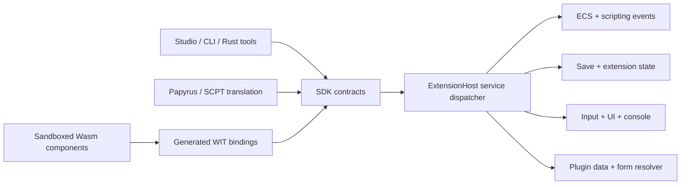

# ByroRedux SDK and extension platform development plan

Status: **In progress**

Date: 2026-09-01

Implementation progress: the first Phase 1 boundary is live in the working
tree. `ObjectId` is public SDK identity, while `StudioSession` and its
`ObjectId <-> EntityId` mapping are private to the executable host. Scene import
sorts the canonical object set before assigning IDs, and snapshots, picking,
commands, and the debug UI no longer expose raw ECS entity IDs.

The second Phase 1 boundary is also live. `byroredux-sdk` now owns validated
extension/principal/capability/service/event/schema identities, versioned
extension manifests, capability requests, event subscriptions, component
schema declarations, and an immutable service catalog. The plugin crate parses
and resolves executable-extension manifests separately from record plugins,
while both paths share one generic dependency graph. `byroredux-mod-runtime`
now validates SDK compatibility before Wasm compilation, rejects undeclared or
unsupported effective grants before instantiation, derives the sandbox
principal from the manifest, and exposes SDK/service version discovery through
the WIT context interface.

The first Phase 2 path is now live in both the headless harness and executable.
The SDK defines opaque
generational `EntityRef` values, finite callback-local entity projections,
typed extension-component schemas and values, a principal-isolated bounded
store, canonical activation/cell-load/combat-hit/equipment/input/session/recurring-update payloads,
principal-owned custom/mod events with 4 KiB opaque payloads, and atomic
deferred command batches. The WIT world exposes `on-activate`,
`on-cell-load`, `on-hit`, `on-equipment-change`, `on-input-action`,
`on-session-event`, `on-custom-event`, `on-update`, custom-event publication
and callback-local payload reads, immutable name/form/world-transform
reads, and a compact own-state increment command.
The runtime resolves schema/field
indices through the authenticated manifest, requires separate event,
entity-read, transform-read, and own-state-write capabilities, discards queued
commands on traps, and enforces a per-entry command budget. The executable owns
the live host, loads a dependency-resolved
set from repeatable `--extension` arguments, applies only explicit
`--extension-grant` authority, commits the profile atomically, adapts live
`ActivateEvent`, `OnCellLoadEvent`, producer-resolved `HitEvent`, and ordered
`EquipmentEventBatch`
markers plus rebinding-independent `ActionState` press/release edges after
releasing ECS guards. It routes exact manifest-declared custom channels in
stable install order, commits publication with the callback's other deferred
commands, defers delivery to the next Late pass, and shuts components down in
reverse order. Native channels remain principal-owned. The first shared
compatibility namespace now maps bounded SKSE ModEvent names reversibly,
preserves case, carries the fixed `SendModEvent` string/float/Form payload in a
versioned wire shape, and routes across principals only with publish/subscribe
capabilities. Extension component rows now live inside the checksummed
ByroRedux save container: transient handles translate to load-order-independent
`FormRef` values, payloads are bounded and preflighted before world teardown,
fresh handles are assigned after reload, and rows for missing packages or
temporarily unloaded forms are retained without a cosave. Exact-version restore
and bounded principal-private persistent storage are implemented, including
deterministic arrays, string-keyed maps, and primitive sets with atomic
deferred mutation and save participation. Scalar storage commands additionally
update a callback-local transaction overlay, so later reads in the same
callback see accepted set/delete/increment operations while traps still discard
the external batch; schema
migrators, additional projection families/events, and status tooling remain
open. The first read-only content service is also live: capability-gated guests
can enumerate the active regular/light plugin order, look up basenames
case-insensitively, inspect each plugin's ordered TES4 master dependencies,
qualify bounded source-local IDs into portable `FormRef` values, and query
whether a consumed authored record exists together with its four-byte record
signature. The executable projects this immutable, bounded snapshot from the
same resolver and parser walk that own live global FormID translation before
callbacks run; override deletions and later re-additions follow load-order
semantics without exposing numeric global FormIDs.
Manifest-declared console commands are now engine-owned as well: granted
packages publish only under `ext.<extension-id>.*`, route to an authenticated
component/declaration index, receive bounded callback-local arguments, return
bounded output, and commit mutations through the existing atomic deferred
batch. Denial leaves no command behind and a guest fault quarantines only its
component.
Manifest-declared script functions are live through the same principal and
capability boundary. Packages publish bounded typed signatures under
`ext.<extension-id>.<function>`. The component-model world exposes a
callback-local typed argument/result interface, validates host arguments before
guest entry, quarantines a guest that omits or returns the wrong result type,
and withholds the result until its deferred command batch is accepted. The
executable routes source ObScript assignments and conditions directly to this
host without an OBSE/xNVSE DLL. Arguments use explicit `boolean:`, `integer:`,
`float:`, or `string:` literals (plus `none`), and the interpreter snapshots
its static statement tree before entering guest code so no ECS guard crosses
the sandbox boundary. Compiled SCDA SDK-call encoding and the general Papyrus
dispatcher remain open. A conservative Papyrus vertical slice is live:
manifest-declared `Provider.Function(...)` aliases lower from parsed source and
decompiled PEX into a typed program, and `OnInit`, `OnLoad`, `OnActivate`,
`OnHit`, `OnObjectEquipped`, `OnObjectUnequipped`, `OnTriggerEnter`, and
`OnUpdate` handlers execute through the same authenticated Wasm host after ECS
guards are released. `OnInit` is emitted once when the
translated program attaches, independently of cell load; trigger handlers
preserve one dispatch per entering actor. `OnHit` projects its four boolean
attack/block flags into typed handler locals. The subset supports scalar locals,
literal or typed scalar-local arguments, assignments, and bounded boolean
branches with negation, short-circuit logical operators,
same-type boolean/integer/float comparisons,
and string equality/inequality. Arithmetic, string concatenation, object
expressions, broader events, other latent primitives, and dynamic object
dispatch remain open. Provider-bearing
handlers support bounded `Utility.Wait` continuations that preserve locals and
ordered branch/enclosing tails across save/load. Restored calls are reconciled
against the live provider catalog before dispatch. Quest and scene fragments
now treat top-level provider calls from source/decompiled PEX as sequencing
barriers, persist them through existing latent continuations, and invoke them
only after fragment ECS guards are released. Successful calls resume later
native effects in the same fragment, including across multiple barriers and
supported conditional branches; failure aborts that fragment's tail. Quest
events, scene invocations,
and ready latent continuations flush each fragment before the next one begins.
The first curated extender-era pack is also executable without an extension
package: ten SKSE `Game` content calls
cover regular/light counts, name-to-index and index-to-name lookup, and active
plugin, dependency-count, and light-plugin master queries. They preserve
SKSE's exact `255` missing sentinel,
`0x100 + lightIndex` combined-index encoding, and `0xffff` missing-light
sentinel. Engine aliases cannot be shadowed by a package, while unrelated
vanilla `Game` calls remain available to other translators.
Typed settings reads are now engine-owned too:
`byro.settings.read` projects the same persisted universal `SettingsRegistry`
consumed by native menus into bounded bool/number/choice values, is available
during component initialization, and refreshes before later callbacks.
Manifest-declared registration is now implemented as well:
granted packages contribute bounded toggle/slider/choice metadata under
`ext.<extension-id>.*`, persisted values are overlaid before guest
initialization, and registration commits atomically with package activation;
`byro.settings.write-own` now queues declaration-indexed updates through the
shared command budget, validates type/range/choice and principal ownership,
then commits and persists the native registry after callbacks without guest
reentrancy.
The first Wave B gameplay service is live as well. Capability-gated callbacks
can read bounded canonical actor-value projections keyed by portable AVIF
`FormRef` identities and queue base, permanent, temporary, damage, or restore
operations. The executable resolves opaque entity handles and portable forms,
stages the complete batch against cloned `ActorValues`, rejects stale or
non-finite results without partial actor mutation, and commits only after the
callback returns.
The first inventory slice is read-only by design: callbacks can inspect a
bounded, deterministic summary aggregated by portable base-form identity,
including 64-bit total counts, the union of occupied biped slots, weapon equip
state, optional validated item name/category/value/weight metadata sourced from
the resolved plugin index, and an explicit truncation flag when a form cannot
be resolved or the budget is exceeded. Per-instance mutation remains closed
until item-instance identity and reconciliation can be made stable across
callback boundaries.
Faction membership reads are also live as a separate semantic service. A
bounded callback-local snapshot exposes portable FACT identities and signed
membership ranks, preserves the engine's first-entry-wins rule for malformed
duplicates, and reports unresolved or over-budget memberships explicitly.
REPU fame/infamy remains a separate actor service. Authored inter-faction
relationships are now a separate immutable service as well: the load-order
resolver projects merged FACT `XNAM` edges once into portable asymmetric
source/target identities, preserves modifier and raw combat reaction, and
reports lossy projection explicitly. Capability-gated WIT lookup never exposes
numeric global FormIDs.
Ranked perk reads are live from the canonical `Perks` component used by actor
spawning and condition evaluation. The callback-local snapshot is bounded,
portable, deterministically ordered, and explicit about invalid or unresolved
entries. Grant/revoke remains closed until the host can validate each PERK's
declared rank limit and honor progression-side effects atomically.
AI package integration now spans both authoritative owners. Bounded snapshots
preserve the ordered ambient candidate stack and active winner plus every live
SCEN package action, its scene/action provenance, winner, and template through
portable identities. `byro.packages.evaluate` queues the same deferred
`EvaluatePackageRequest` observed by ambient and scene selectors; it never
rewrites behavior components directly. World-command flushing now runs after
every callback phase, including input, session, custom, recurring update, and
console delivery, rather than leaving non-entity callback writes pending.
The first spatial service is live as a bounded, read-only authored-reference
query. Capability-gated callbacks can search the latest live snapshot around
an arbitrary finite world position, receive distance-sorted portable `FormRef`
hits, and detect truncation. The boundary excludes raw ECS IDs and unauthored
runtime entities; spawn/despawn remains closed until stable identity and
lifecycle reconciliation contracts exist.

## 1. Outcome

Build an engine-native SDK that serves both trusted tools and sandboxed mods.
ByroRedux extensions must not require SKSE, F4SE, xNVSE, OBSE, an address
library, process injection, or version-specific memory hooks. Facilities that
script extenders historically bolted onto Creation Engine become versioned
ByroRedux services backed by the ECS, scripting runtime, save system, input,
UI, and plugin resolver.

The first supported release is a deliberately narrow vertical slice, not full
extender parity. It is complete when the same semantic SDK supports two clients:

1. Studio can inspect and edit an imported NIF or SPT document through stable
   IDs, immutable snapshots, and validated commands.
2. A sandboxed WebAssembly component can declare capabilities, initialize,
   subscribe to a canonical engine event, read an allowed entity projection,
   attach namespaced state, update that state when the event fires, emit an
   attributed diagnostic, and shut down.
3. The extension's engine-owned state survives save/reload without a cosave.
4. Capability denial, fuel exhaustion, invalid handles, and guest faults affect
   only the responsible extension and never partially mutate the world.
5. The workflow runs headlessly in conformance tests and through the live engine
   without Vulkan-specific API entering the SDK.

The broader product goal is reached only when common extender-era facilities
have engine-native equivalents or explicit compatibility adapters. Section 11
tracks that work beyond v0.1.

## 2. What “no script extender required” means

### 2.1 Required properties

- **Semantic APIs, not hooks.** Mods ask the engine to perform an operation;
  they never patch a function, inspect an address, or dereference an engine
  object.
- **Engine-owned lifecycle.** Discovery, dependency resolution, capability
  grants, initialization, event delivery, save participation, shutdown, and
  fault isolation belong to ByroRedux.
- **Stable identity.** Public entity, form, document, object, event, and service
  handles are versioned SDK values. Raw `EntityId`, pointers, Vulkan handles,
  and process addresses never cross the supported boundary.
- **Cross-game semantics.** A capability such as reading equipment or
  subscribing to activation has one ByroRedux contract across Oblivion through
  Starfield. Per-game data translation stays behind the host.
- **First-class extensible state.** Mods can define schema-checked, namespaced
  component data attached to stable entities. The engine can query, inspect,
  save, migrate, and remove that data.
- **One service catalog.** Built-in engine scripts, translated Papyrus/SCPT,
  trusted tools, and sandbox guests reach the same semantic operations rather
  than accumulating four subtly different implementations.
- **Graceful compatibility.** Known SKSE/F4SE/xNVSE/OBSE script functions map to
  semantic services when practical. Unsupported calls produce an attributed,
  actionable diagnostic rather than disappearing or corrupting state.

### 2.2 Compatibility policy

ByroRedux targets source and behavior compatibility where it is useful. It does
not load legacy extender DLLs or emulate their binary ABI. Native plugins built
around offsets, trampolines, RTTI addresses, or arbitrary memory access must be
ported to the SDK. This is intentional: reproducing the injection mechanism
would preserve the fragility the new engine is meant to remove.

## 3. Intended users

- ByroRedux-owned tools such as Studio, command-line asset processors,
  validators, and conversion tools.
- Community mods compiled as sandboxed WebAssembly Components.
- Translated Papyrus and SCPT content calling engine-native services.
- Third-party Rust tools embedded in the same process as a ByroRedux host.
- Automated tests using a renderer-free reference host.

## 4. Current baseline

The repository already contains useful but disconnected foundations.

### 4.1 Tooling prototype

- [`crates/sdk/src/identity.rs`](../../crates/sdk/src/identity.rs) defines the
  first stable SDK identity, `ObjectId`.
- [`crates/sdk/src/studio.rs`](../../crates/sdk/src/studio.rs) owns asset bounds,
  Cornell-room fitting, snapshots, picking, and typed commands.
- [`byroredux/src/studio_host.rs`](../../byroredux/src/studio_host.rs) translates
  those commands to ECS reads and writes through a private object/entity map.
- [`crates/debug-ui/src/panels.rs`](../../crates/debug-ui/src/panels.rs) consumes
  snapshots and emits commands without mutating the world directly.

Studio public identities are now document-local `ObjectId` values. Commands
still have no typed result, and there is no edit history or persisted document
format.

### 4.2 Engine-native scripting

- [`crates/scripting/src/lib.rs`](../../crates/scripting/src/lib.rs) registers
  ECS-native events, timers, conditions, quest/scene fragments, packages,
  dialogue, and translated script behaviors.
- Canonical events already include activation, hit, cell-load, trigger, equip,
  update, animation, splash, and ripple shapes.
- [`crates/scripting/src/registry.rs`](../../crates/scripting/src/registry.rs)
  maps legacy script identities to statically compiled ECS spawners.

This proves the correct engine-side semantics, but it is a compile-time Rust
surface. Community extensions cannot register schemas, subscribe through a
stable API, or call a shared service catalog.

### 4.3 Sandboxed executable mods

- [`crates/mod-runtime/src/lib.rs`](../../crates/mod-runtime/src/lib.rs) provides
  principal identity, explicit capabilities, per-instance Wasmtime stores,
  memory/fuel/log limits, lifecycle state, and quarantine.
- [`crates/mod-runtime/wit/host.wit`](../../crates/mod-runtime/wit/host.wit)
  exposes logging, principal context, deferred own-state mutation,
  initialization/shutdown, canonical gameplay callbacks, normalized input,
  recurring updates, and committed session lifecycle.
- The runtime has strong unit coverage and a first non-test engine owner for
  manifest loading, lifecycle, diagnostics, event delivery, input, and save
  participation. UI contribution and broader semantic services remain open.

### 4.4 Storage and registration constraints

- Core ECS components are Rust `Component` types selected by `TypeId`; guests
  cannot safely manufacture new Rust types at runtime.
- Save registration is also typed at compile time.
- Record-oriented plugin manifests still carry identity, version, and record
  dependencies. Executable extensions now use the separate SDK
  `ExtensionManifest`, which carries SDK ranges, dependency version ranges,
  components, capability requests, subscriptions, and state schema versions.

The SDK now provides the bounded, principal-isolated reference implementation
of an engine-owned dynamic extension-component store. The executable owns its
live instances and stable-handle map. The store complements the typed ECS
rather than pretending arbitrary guest schemas are Rust `Component`
implementations.

## 5. Architectural boundary



The boundary obeys these rules:

- `byroredux-sdk` defines engine-neutral identities, values, manifests,
  snapshots, requests, results, events, schemas, and errors.
- `byroredux-mod-runtime` owns untrusted code execution, resource budgets, and
  generated guest bindings. It does not implement gameplay semantics.
- `byroredux-scripting` and other engine crates implement semantic services.
- The executable owns the live `ExtensionHost`, main-thread mutation queue,
  scheduling points, and subsystem adapters until a reusable host crate is
  justified.
- Rust and WIT surfaces are projections of one versioned service schema. CI
  checks their service IDs, field shapes, capability requirements, and contract
  version so they cannot drift silently.
- There is no ambient filesystem, network, process, environment, GPU, or raw
  memory access. Such authority can only appear later as an explicit,
  separately reviewed capability.

## 6. Public contract shape

### 6.1 Proposed SDK modules

| Module | Responsibility |
| --- | --- |
| `identity` | `SdkVersion`, `DocumentId`, `ObjectId`, `EntityRef`, `FormRef`, `PrincipalId`, and service/event IDs |
| `manifest` | Extension identity, SDK range, dependencies, requested capabilities, entry point, subscriptions, and schemas |
| `value` | Finite math values, bounded strings, form/entity projections, and schema-safe field values |
| `service` | Requests, responses, errors, capability metadata, and service discovery |
| `event` | Canonical event envelopes, filters, subscription declarations, and delivery cursors |
| `component` | Dynamic extension-component schemas, rows, ownership, migrations, and query values |
| `content` | Loaded-plugin snapshots, stable source identity, slot class, and portable form qualification |
| `storage` | Principal-scoped persistent collections for data that is not entity-attached |
| `script_function` | Typed, bounded function declarations and values shared by engine scripts and sandbox guests |
| `document` | Studio snapshots, object capabilities, commands, history values, and persisted overrides |
| `host` | Traits used by live and in-memory hosts; no ECS or renderer types |
| `studio` | Bounds, fitting, picking, and temporary prototype compatibility re-exports |

### 6.2 Stable identity

`EntityId` must not cross the supported SDK boundary. Runtime entities use an
opaque `EntityRef` resolved by the live host and invalidated explicitly on
despawn or world generation change. Persisted references use stable form/source
identity where available; a transient entity is never silently persisted as if
it were stable.

Studio assigns deterministic `ObjectId` values from import provenance and keeps
a private `ObjectId <-> EntityId` map. Reloading unchanged source content must
produce the same IDs. Source drift is diagnosed rather than retargeted by
guesswork.

### 6.3 Manifests and capabilities

An extension manifest declares at least:

```text
id, display name, version
supported SDK version range
dependencies and optional dependencies
Wasm component entry point
requested capabilities
event subscriptions and filters
extension-component schemas and schema versions
principal-storage schema version
```

Capabilities are namespaced and operation-specific. Initial examples:

```text
byro.log.write
byro.world.entity.read
byro.world.transform.read
byro.world.transform.write
byro.events.subscribe
byro.events.publish
byro.components.read
byro.components.write-own
byro.storage.read-own
byro.storage.write-own
```

An extension may mutate only its own component/storage namespace by default.
Cross-principal access and destructive world operations require distinct grants.
Capability checks happen in the host adapter immediately before the operation,
not only during manifest resolution.

### 6.4 Dynamic extension components

The engine owns an `ExtensionComponentStore` keyed by:

```text
(principal, schema id, stable entity identity) -> validated row
```

Schemas use a bounded set of portable field types: booleans, signed/unsigned
integers, finite floats, bounded strings/bytes, form/entity references, and
bounded lists/maps. Every schema has a version and optional deterministic
migration chain.

The store must support:

- attach, read, update, remove, and filtered query;
- principal and capability isolation;
- entity-despawn cleanup;
- deterministic save/load;
- debug-protocol inspection;
- change/event emission; and
- bounded row count, field size, query result size, and per-frame mutation work.

Typed Rust ECS components remain the hot-path engine representation. Dynamic
extension components are the safe mod-defined state layer; explicit adapters
may mirror selected schemas into typed engine behavior.

### 6.5 Events and scheduling

The canonical event catalog extends the existing ECS markers rather than
creating a parallel hook system. Subscriptions are declared in the manifest.
Delivery uses stable event IDs, bounded payloads, and optional engine-defined
filters. Custom channels use the exact
`mod.<principal>.event.<channel>` shape; only the authenticated owner may
publish them, while any explicitly subscribed principal may receive them.
Publication requires `byro.events.publish`, is part of the callback's atomic
deferred batch, and enters a bounded transient queue.

Guests never run while arbitrary ECS locks are held. The frame sequence is:

1. The host drains custom events committed before this scheduler pass.
2. Engine systems emit canonical events.
3. The host snapshots bounded payloads and resolves subscriptions.
4. Guest callbacks run with fuel/time/memory limits against a read snapshot.
5. Guest mutations and publications enter a validated command buffer. Scalar
   principal-storage commands also update a callback-local overlay for
   read-your-writes without bypassing the external commit barrier.
6. The engine applies accepted commands atomically at a declared stage.
7. Results and diagnostics are attributed to the principal.

This prevents guest reentrancy and preserves the scheduler's declared-access
and lock-order invariants.

### 6.6 Semantic service catalog

Engine behavior is exposed as named, versioned operations rather than memory
layout. Each service declares its request/response schema, required capability,
thread/stage rules, determinism, and failure modes.

Translated Papyrus/SCPT calls and legacy compatibility aliases resolve into
this catalog. Extensions expose script-callable functions only through a
bounded typed provider interface; they cannot register a native function
pointer. The current source-ObScript adapter enters that dispatcher only after
snapshotting and releasing ECS guards. Guest mutations remain deferred and the
typed result is published only after the host accepts the complete command
batch.

### 6.7 Persistence

Extension state is part of the ByroRedux save transaction, not a separate
cosave. The save contains principal ID, extension version, schema versions,
entity-attached component rows, principal storage, and migration metadata.

Load validates manifests and schemas before applying any extension state. A
missing extension retains an opaque, bounded state blob for possible later
recovery or reports a clear policy decision; it never binds that state to a
different principal. Migration failure quarantines the extension state without
invalidating the base save.

Studio persistence remains an override document: source identity/fingerprint,
object-keyed transform/material overrides, and editor metadata. Filesystem IO
belongs to the host, not `byroredux-sdk`.

## 7. Script-extender replacement map

| Extender-era mechanism | ByroRedux engine-level replacement |
| --- | --- |
| Version-specific hooks and trampolines | Canonical ECS events and semantic service calls |
| Address libraries and RTTI offsets | Stable service IDs, schemas, and capability discovery |
| Native Papyrus function registration | Service catalog plus queued script-function providers |
| SKSE/F4SE messaging interfaces | Typed event bus with principal attribution and bounded payloads |
| `StorageUtil` / JContainers-style state | Namespaced extension components and persistent collections |
| Cosave serialization callbacks | Transactional extension columns in the engine save format |
| Input hooks and key registration | Capability-gated normalized action subscriptions with manifest filters |
| Scaleform injection | Versioned UI/menu contribution service with isolated data/actions |
| Console command registration | Namespaced command descriptors and typed command dispatch |
| Form/plugin/load-order inspection | Stable form resolver and plugin dependency/catalog service |
| Arbitrary object extra data | Schema-defined extension components attached to stable entities |
| Direct engine object or memory access | No equivalent; explicit semantic capability required |

The first exact source-alias pack covers global (`ObjKey == None`)
`StorageUtil` integer and string get/has/set/unset calls. Each descriptor names
the concrete `byro.storage` recipe, expected WIT value variant, and isolation
constraint. An executable SDK adapter case-folds and type-namespaces portable
keys, preserves missing values and synchronous returns, maps zero/empty sets to
deletion, and reports whether unset found a value. The storage service supplies
the callback-local read-your-writes needed by those recipes. Adjust, Float,
Form, pluck, file-backed, list, object-scoped, arbitrary-key, and cross-mod
shared calls remain deliberately unsupported until an engine service can honor
their complete semantics. Recognizing the provider is not enough to claim
compatibility. The function signatures are anchored to PapyrusUtil's
[published `StorageUtil.psc`](https://github.com/eeveelo/PapyrusUtil/blob/master/Scripts/Source/StorageUtil.psc).

The first JContainers replacement is a separate `byro.legacy-containers`
service rather than a lossy projection onto primitive storage collections. It
provides principal-local integer handles for mixed typed `JArray` and
string-keyed `JMap` objects, including nested object handles, stable Forms, and
bit-preserved floats. Successful callbacks commit the bounded registry
atomically; trapped or rejected callbacks do not. Registries round-trip in the
engine extension-save payload and survive temporarily unavailable packages.
The initial source aliases cover object/count/clear/release, typed array
add/get/set/erase, and typed map get/set/has/remove calls. Each principal is
limited to 256 objects, 4096 aggregate entries, and 4096 UTF-8 bytes per key or
string. `JDB`, path solving, JSON files, Lua, cross-mod global databases, and
Form/int-keyed map providers remain explicitly unsupported instead of being
classified as compatible merely because their provider name is recognized.

The first event adapter covers fixed-arity
`Form`/`Alias`/`ActiveMagicEffect.SendModEvent`. It maps the original event
name to the shared engine-owned compatibility bus and preserves the string,
float, and stable sender form synchronously without an SKSE DLL. The lower-level
`ModEvent.Create/Push*/Send/Release` family now uses an engine-owned transient
typed builder: handles are non-zero and bounded per adapter, bool/int/float/
string/Form arguments retain order and type, oversized pushes are ignored like
the legacy void-return calls, and Send atomically releases into the shared bus.
Runtime `RegisterForModEvent`, `UnregisterForModEvent`, and
`UnregisterForAllModEvents` adapters now queue capability-gated subscription
mutations in the same atomic callback batch. Successful registration exposes
the bounded callback identifier during delivery; registrations remain
transient and are refreshed after load, matching SKSE's lifecycle contract.

The first pre-Skyrim compatibility ingestion path is live at the SCPT attach
boundary. Preserved `SCTX` source is scanned without treating identifiers in
comments or strings as calls, and xNVSE `GetNVSEVersion`/
`GetNVSERevision`/`GetNVSEBeta` plus OBSE `GetOBSEVersion`/
`GetOBSERevision` probes map to `byro.context` feature discovery in the same
bounded, fingerprint-deduplicated registry used by PEX. This is preflight and
porting evidence, not an ObScript interpreter. A bounded `SCDA` decoder now
walks verified statement framing, reference-call headers, and ordinary
`Set`/`If`/`ElseIf` expression call tags. It recovers the supported xNVSE/OBSE
version and load-order opcodes from source-less records, selects the dialect
from the parsed game/profile boundary, and reports malformed lengths without
guessing past damaged data. The decoder's framing was exercised across every
compiled SCPT in the installed Fallout New Vegas and Oblivion masters. Extended
expression-evaluator payloads and runtime variable resolution remain pending.
The first shared load-order pack now executes
`IsModLoaded`, `GetModIndex`, `GetNumLoadedMods`/`GetNumLoadedPlugins`, and
`GetNthModName` directly against `byro.content.catalog`. The SCDA bridge decodes
their bounded string and numeric literals into typed SDK calls, preserves the
classic `255` missing-index sentinel and empty-string nth-name result, and
rejects catalogs that cannot be represented by the classic 8-bit load order.
Numeric indices are callback-local compatibility values; portable forms
continue to use stable source identity. Version probes deliberately remain
feature-discovery evidence instead of returning a fake extender version.
At live SCPT attachment, supported `Set` statements and nested
`if`/`elseif`/`else` branches now translate into one static ECS statement tree.
Preserved `SCTX` is preferred; source-less `SCDA` accepts exact `Begin`/`Set`/
`If`/`ElseIf`/`Else`/`EndIf`/`End` framing, resolves target indices through
`SLSD`, and accepts only a single complete supported command-expression token
on each right-hand side or condition. `GameMode`, `OnLoad`, and `OnActivate`
dispatch synchronously against the same live content-catalog snapshot exposed
to sandbox extensions and write results into the existing save-backed
`ScriptVariables` component. Nesting and
`elseif` chain length are capped at 32; a handler containing any unsupported
statement, expression tail, event filter, or malformed branch is rejected as a
unit, so partial translation cannot reorder or accidentally expose its body.
Source handlers may additionally assign or branch on a manifest-declared
`ext.<extension-id>.<function>` call. Scalar/string literals are explicitly
typed, declaration validation happens before guest entry, and numeric results
write through the same save-backed `ScriptVariables` path. This is an
engine-level provider call, not an emulated extender version or injected
native function.
`GetSourceModIndex`, reference construction, and all other xNVSE/OBSE commands
remain explicit gaps. Command names and legacy result contracts are anchored
to the [xNVSE implementation](https://github.com/xNVSE/NVSE/blob/master/nvse/nvse/Commands_Game.cpp)
and [xOBSE implementation](https://github.com/llde/xOBSE/tree/master/obse/obse).

The preflight CLI accepts loose `.psc`/`.pex` files and BSA/BA2 script
archives. An opt-in real-mod gate scans Workshop Framework's unmodified
compiled Fallout 4 scripts: its F4SE version probes map to `byro.context`,
while `UI.IsMenuRegistered` and `Input.GetMappedKey` remain explicit policy
gaps. This keeps compatibility claims tied to shipping mod bytecode without
checking third-party assets into the repository.

## 8. v0.1 delivery phases

Each phase lands independently with tests and documentation. A plan update is
not a substitute for its exit gate.

### Phase 0 — contract authority and dependency hygiene

Deliverables:

- Record this boundary in crate-level documentation and an architecture
  decision record.
- Add `#![forbid(unsafe_code)]` to the SDK and require documentation on its
  supported public surface.
- Define supported versus experimental API markers and service version rules.
- Establish one service-schema source of truth with Rust/WIT conformance checks.
- Add package metadata and a dependency gate forbidding renderer, UI, platform,
  archive, executable, and Wasmtime dependencies in `byroredux-sdk`.

Exit gate:

- SDK docs build without warnings.
- Rust/WIT schema drift fails CI.
- The allowed dependency list is explicit and checked.

### Phase 1 — identities, manifests, and discovery

Deliverables:

- Introduce stable SDK identity newtypes and remove public `EntityId` use.
- Add extension manifests with SDK ranges, dependencies, capabilities,
  subscriptions, and state schemas.
- Reuse or bridge the existing plugin DAG rather than implementing a second
  dependency resolver.
- Add service/capability discovery so an extension can feature-detect without
  guessing an engine build.
- Add deterministic Studio `ObjectId` derivation and live `EntityRef`
  generation/invalidation rules.

Exit gate:

- Manifest conflicts and unsupported SDK ranges fail before compilation.
- Reloading the same fixtures reproduces stable IDs.
- No supported SDK value exposes an ECS ID or engine pointer.

### Phase 2 — extension state and event vertical slice

Status: **Activation, cell-load, combat-hit, equipment-change, normalized
input, committed session-lifecycle, and bounded recurring-update paths, live
ECS adapters, principal storage, and the first immutable entity projection
implemented; additional projection families remain pending.**

Deliverables:

- Implement the bounded `ExtensionComponentStore` and principal storage.
- Define the first event envelope and adapters for `OnActivate`, `OnCellLoad`,
  `OnEquip`, and bounded recurring updates.
- Extend WIT with entity projection, own-state access, event subscription, and
  event callback exports.
- Add a validated guest command buffer and atomic main-thread apply stage.
- Preserve existing runtime fuel, memory, log, and quarantine behavior.

Exit gate:

- A fixture guest increments entity-attached state on activation.
- A recurring fixture waits one full declared interval, receives bounded
  elapsed time, retains overshoot, and runs at most once per frame.
- A denied write is rejected and quarantines or faults only that guest according
  to documented policy.
- No guest executes while an ECS storage/resource guard is held.
- Event and mutation budgets are enforced under adversarial tests.

### Phase 3 — live engine ownership and lifecycle

Status: **First executable-owned lifecycle slice implemented; status surfaces,
resource telemetry, a reusable in-memory host, and richer transitions pending.**

Deliverables:

- Add the engine-owned extension manager: discover, resolve, grant, compile,
  instantiate, initialize, dispatch, drain diagnostics, shutdown, and unload.
- Integrate deterministic scheduling stages and world/cell transition behavior.
- Surface extension status, grants, resource use, faults, and queued work in the
  debug protocol and overlay.
- Make one guest fault non-fatal to the frame and to other extensions.
- Add a headless in-memory host implementing the same SDK traits.

Exit gate:

- The same lifecycle/event fixture passes against in-memory and ECS hosts.
- Initialization order follows the dependency DAG; shutdown is reverse order.
- Cell reload and save load invalidate or rebind handles deterministically.

### Phase 4 — save integration and first extender facilities

Status: **Exact-version entity-attached and principal-storage persistence
and the first read-only plugin/form catalog, manifest-declared namespaced
console registration, and typed universal-settings reads implemented;
migrations, service aliases, broader record metadata, and real-mod fixtures
remain pending.**

Deliverables:

- Register extension state as bounded, checksummed save data with schema
  versions and migrations.
- Implement typed custom/mod events and principal-scoped persistent
  collections.
- Add read-only plugin/form catalog services and a namespaced console-command
  registration slice. **Plugin enumeration and portable form qualification are
  implemented. Namespaced, capability-gated console registration and bounded
  callback dispatch are implemented; dependency edges and portable record
  existence/type inspection are implemented.**
- Add SDK aliases for the first selected extender-script fixture, mapping it to
  semantic services rather than reproducing its implementation internals.
- Add corrupt, missing-extension, downgrade, and migration-failure tests.

Exit gate:

- Activate -> mutate -> save -> reload -> activate preserves and advances the
  same extension state without a cosave.
- Removing one extension does not corrupt the base save or another principal's
  state.
- The selected real mod fixture no longer requires its extender library for the
  covered behavior.

### Phase 5 — Studio migration and v0.1 release gate

Deliverables:

- Convert Studio snapshots and commands to stable SDK IDs and typed results.
- Split persistent document edits from viewport requests.
- Add revision checks, edit grouping, bounded undo/redo, and versioned override
  serialization.
- Run Studio and the extension fixture through shared service/value/error
  contracts where their semantics overlap.
- Publish Rust and guest examples, manifest templates, API docs, migration
  notes, and the v0.1 compatibility statement.

Exit gate:

- Studio retains transform/material/pick/frame behavior and adds undo/redo plus
  override save/open.
- The extension vertical slice works headlessly and in the live engine.
- All v0.1 conformance, docs, feature, and safety gates pass.

## 9. v0.1 verification matrix

| Layer | Required verification |
| --- | --- |
| Pure SDK | Identity determinism, value validation, manifest resolution, service/version matching, schema compatibility |
| Mod runtime | Capability denial, fuel/memory/event limits, lifecycle, fault isolation, no ambient WASI |
| Extension state | Ownership, bounds, query filters, despawn cleanup, deterministic save/load, migrations |
| Scripting bridge | Canonical event mapping, ordering, payload fidelity, no guard held across guest execution |
| ECS host | Handle mapping, atomic command apply, stale-handle rejection, world-generation transitions |
| Studio | Stable snapshots, revision rules, edit grouping, undo/redo, override serialization |
| Integration | Loose/archive NIF Studio, SPT Studio, sandbox activation fixture, save/reload fixture |
| Compatibility | One real extender-dependent script fixture mapped to semantic services with explicit diagnostics for unsupported calls |

Expected commands at the release gate include:

```bash
cargo test -p byroredux-sdk
cargo test -p byroredux-mod-runtime
cargo test -p byroredux-scripting
cargo test -p byroredux studio
cargo test -p byroredux-debug-ui
cargo clippy -p byroredux-sdk --all-targets --all-features -- -D warnings
cargo clippy -p byroredux-mod-runtime --all-targets --all-features -- -D warnings
cargo doc -p byroredux-sdk --no-deps
```

## 10. Compatibility and security policy

- Before the v0.1 tag, prototype names may change with a migration note.
- After v0.1, supported Rust and WIT contracts follow semver; breaking service
  or schema changes require a new compatible version path.
- Save/document format versions are independent of crate semver.
- Persisted enums use explicit representations and forward-compatible decoding.
- Experimental modules and capabilities are marked and excluded from the
  compatibility promise.
- Guest input is untrusted even after manifest approval. Every string, list,
  row, query, event, log, and command has a configured bound.
- Capability possession does not bypass validation, ownership, scheduling, or
  rate limits.
- No third-party native dynamic library is loaded into the engine process as
  part of the supported extension model.

## 11. Extender-equivalence roadmap after v0.1

The project-level objective is not complete at the v0.1 vertical slice. Parity
proceeds by semantic domain and closes only against real mod fixtures.

### Wave A — common infrastructure

- Custom/mod events and filtered subscriptions. **Implemented for exact,
  manifest-declared principal channels with a separate publish capability,
  4 KiB payloads, bounded engine queueing, atomic publication, deterministic
  routing, and next-pass non-reentrant delivery; typed payload schemas remain.**
- Persistent maps, arrays, sets, and entity-attached extension components.
  **Principal-private arrays, string-keyed maps, and primitive sets are
  implemented with deterministic serialization, explicit collection APIs,
  per-collection bounds, atomic batches, and in-save persistence. Dynamic
  entity-attached component rows are also implemented; collection-valued
  component fields and filtered collection queries remain.**
- Input action/control subscriptions after user rebinding. **Implemented for
  the engine's normalized action catalog with press/release edges and validated
  action filters; custom action registration remains.**
- Namespaced console commands and settings. **Manifest-declared commands are
  implemented under the engine-owned `ext.<extension-id>.*` namespace with
  bounded arguments/output, atomic deferred mutation, capability denial, and
  per-component fault isolation. Capability-gated typed reads project the
  native universal settings registry with startup-correct and live-refreshed
  bool/number/choice values. Granted manifests can register bounded native
  toggle/slider/choice controls under `ext.<extension-id>.*`, atomically with
  package activation and persisted-value overlay. Capability-gated writes are
  declaration-indexed, command-budgeted, type/range/ownership validated,
  applied after callbacks, persisted, and reflected into the next snapshot.**
- Plugin/form/dependency introspection. **Loaded regular/light plugin
  enumeration, case-insensitive basename lookup, stable source identity, and
  bounded portable form qualification are implemented behind
  `byro.content.catalog.read`; ordered master edges and portable record
  existence/type metadata are also implemented.**
- Save/load/new-game lifecycle events. **Implemented with `new-game`,
  `save-complete`, and `load-complete` phases, validated manifest filters, a
  bounded engine queue, and post-commit save/load production; numeric slots are
  exposed without host filesystem paths.**

### Wave B — gameplay services

- Form metadata, keywords, names, weights, and stable lookup.
- Actor values, inventory, worn equipment, packages, factions, perks, magic,
  appearance refresh, animation requests, and relationship queries. **Actor
  values are implemented as bounded callback-local snapshots plus validated,
  deferred semantic writes keyed by portable AVIF identity. Ambient and active
  scene package stacks are exposed together with capability-gated semantic
  reevaluation through the shared engine marker. Inventory and worn
  equipment have a capability-gated, read-only aggregated snapshot with item
  names, categories, values, weights, and explicit truncation; mutation and the
  remaining gameplay domains are pending. Portable faction membership/rank
  reads are implemented separately. REPU-backed fame/infamy reads plus atomic,
  capability-gated add/reset mutations are implemented against the canonical
  actor component. Directional inter-faction FACT relationships are implemented
  as a bounded immutable load-order snapshot with portable identities, exact
  modifier/raw-reaction preservation, explicit truncation, and a separate read
  capability. Ranked perk reads are implemented from the canonical live
  component; perk mutation remains pending rank-limit and progression
  validation. Authored IDLE animation state and behavior-event generations are
  projected through portable identities; capability-gated playback requests
  resolve the IDLE record and delegate to the same cinematic actor request
  consumed by translated Papyrus rather than accepting clip names or runtime
  handles. General animation graph control remains pending.**
- World/reference spatial queries and safe spawn/despawn operations. **Bounded
  radius queries over live authored references are implemented with portable
  identities, deterministic distance ordering, explicit truncation, and no raw
  ECS handles. Safe spawn/despawn remains pending.**
- Typed script-callable extension functions. **The SDK contract is implemented:
  manifest-local function/parameter identities, ordered typed parameters,
  optional suffix rules, finite scalar and portable form/entity values, bounded
  strings/calls, result validation, and principal-qualified names. Manifest
  publication is also implemented with bounded unique declarations, component
  target validation, and TOML conformance. WIT callback dispatch is live with
  host-side argument/result validation, deferred atomic mutation, and component
  quarantine on an invalid result. Source ObScript can call the same live host
  through `ext.<extension-id>.<function>` assignments and conditions without
  OBSE/xNVSE. Manifest-declared `Provider.Function(...)` aliases now lower
  case-insensitively from parsed Papyrus and decompiled PEX into a typed,
  guard-free event program that calls the same live host. Supported events are
  `OnInit`, `OnLoad`, `OnActivate`, `OnHit`, `OnObjectEquipped`,
  `OnObjectUnequipped`, `OnTriggerEnter`, and `OnUpdate`. Program attachment
  emits one engine-owned initialization marker; trigger entry multiplicity and
  ordered wearer equipment transitions are preserved. The
  four scalar `OnHit` attack/block parameters are projected under their authored
  names. The current subset covers scalar locals, literal or typed local
  arguments, assignments, and bounded boolean branches, including negation,
  short-circuit logical operators, same-type boolean/integer/float comparisons,
  and string equality/inequality over locals, literals, and provider results. A synthetic
  byte-level Skyrim PEX fixture now exercises the production
  reader/decompiler/translation boundary.
  Quest/scene fragment PEX now lowers top-level provider calls as sequencing
  barriers, preserves them across the existing latent continuation queue, and
  dispatches them only after fragment guards drop. A successful call resumes
  later native effects within that fragment, including across multiple
  barriers and supported conditional branches; failure aborts its remaining
  tail. Quest, scene, and ready-continuation batches now flush every fragment
  before starting the next independent item.
  Provider-bearing event handlers now suspend across bounded `Utility.Wait`
  calls while preserving locals and ordered branch/enclosing tails. Compiled
  SCDA call encoding, arithmetic/string-concatenation/object expressions,
  broader events, other latent primitives, and dynamic object dispatch remain
  pending. The continuation queue is registered with the save system and revalidates saved
  routes against the live catalog before resuming.
  Ten exact SKSE `Game` content extensions are now engine-owned
  catalog aliases: `GetModCount`,
  `GetModByName`, `GetModName`, `IsPluginInstalled`, `GetLightModCount`,
  `GetLightModByName`, `GetLightModName`, `GetModDependencyCount`,
  `GetLightModDependencyCount`, and `GetNthLightModDependency`. They need
  neither a Wasm package nor an extender DLL and preserve regular/light SKSE
  index encodings.**

These services land only when the underlying engine subsystem has canonical
semantics. The SDK must not expose a fake operation that cannot be honored.

### Wave C — presentation and tooling

- UI/menu contributions and action routing without arbitrary Scaleform object
  injection.
- Notifications, widgets, configuration panels, and localization.
- Extension packaging, signing/trust policy, dependency diagnostics, profiling,
  and hot-reload where state migration makes it safe.

### Wave D — per-game compatibility packs

- Curated SKSE, F4SE, xNVSE, and OBSE script API aliases backed by the common
  service catalog. **The first exact SKSE pack is live: ten `Game` regular
  and light-plugin discovery, dependency-count, and master-lookup calls route
  through `byro.content.catalog.*`;
  engine-owned aliases are reserved against package shadowing. Broader
  compatibility packs remain.**
- Automated source/PEX scans that report supported, mapped, and unsupported
  calls before launch. **Decoded PEX call-site extraction and compatibility
  classification are implemented, including full-property bodies, optional
  source lines, engine-service mappings, and explicit sandbox-policy
  diagnostics. Translation invokes this preflight before decompilation. A
  checked-in byte-level Skyrim PEX conformance fixture now guards mapped
  StorageUtil/mod-event calls, an unsupported JsonUtil call, vararg counts,
  and debug source-line attribution through the real decoder. Parsed Papyrus
  source can now be scanned through the same catalog with recursive AST
  coverage, byte spans, source lines, scopes, and argument counts. Live VMAD,
  quest-fragment, and scene-fragment attachment now feed a bounded,
  fingerprint-deduplicated world registry without reparsing PEX; `sdk.compat`
  exposes its deterministic aggregate to operators. Preserved SCPT `SCTX`
  source is now scanned at live attachment too: xNVSE/OBSE version probes map
  to context feature discovery, shared plugin/load-order queries map to the
  content catalog, and unrecognized `GetNVSE*`/`GetOBSE*` probes are reported
  as unsupported. Eager scanning of every script in the full load-order
  archives, broader command-pack classification, non-literal SCDA argument
  evaluation, comparisons/operators, and general ObScript execution remain
  pending. The load-order subset is executable end to end both as typed
  compiled-call semantics and as live conditional `SCTX` or source-less `SCDA`
  event handlers against the engine content catalog.**
- Real-mod conformance suites per game; each facility is considered covered
  only when behavior, save persistence, and failure handling pass.

Binary extender plugins remain unsupported. A source-level porting guide maps
their hooks to events/services and their attached memory to extension schemas.

## 12. Principal risks and controls

| Risk | Control |
| --- | --- |
| The SDK becomes a re-export of engine internals | Opaque handles, value projections, host traits, and dependency gates |
| Rust and WIT APIs drift | One service schema plus generated/validated projections and contract hashes |
| Dynamic mod state bypasses ECS invariants | Engine-owned schema store, bounded values, staged commands, and explicit typed adapters |
| Guest callbacks deadlock or reenter ECS | Snapshot/event delivery outside locks and atomic deferred mutation |
| A mod monopolizes a frame | Fuel, memory, event, query, command, and wall-time budgets with quarantine |
| Save data becomes tied to load order or ECS IDs | Principal/schema versions plus stable form/source identity and migrations |
| Compatibility aliases fork engine behavior | Every alias delegates to the semantic service catalog |
| Scope expands into every extender API at once | v0.1 vertical slice followed by fixture-driven domain waves |
| “Compatibility” revives unsafe binary injection | Explicit no-native-DLL policy and no raw memory/address capability |

## 13. First implementation slice

Begin with Phases 0 and 1, then prove Phase 2 with one activation fixture:

1. Introduce SDK identity, manifest, capability, event, component-schema, and
   service-error types without removing prototype re-exports yet.
2. Add conformance metadata to `host.wit` and fail CI when Rust/WIT service
   contracts diverge.
3. Resolve the separate extension manifest contract through the generic graph
   shared with the existing plugin resolver instead of creating a second
   dependency algorithm.
4. Replace Studio's public `EntityId` with deterministic `ObjectId` and a private
   host map.
5. Implement a minimal `ExtensionComponentStore` and canonical activation event
   adapter.
6. Run a sandbox guest that increments its own component on activation; verify
   capability denial and quarantine in the same harness.

This slice establishes stable identity, authority, state ownership, and event
delivery—the four boundaries every later extender-equivalent service depends
on.

## 14. Next implementation slice — Papyrus provider dispatch

Status: **In progress.** The first source/decompiled-PEX vertical slice is
executable in the live engine, including bounded `Utility.Wait` suspension. It
remains a conservative translator, not a general stack VM, and it does not load
extender DLLs.

### 14.1 Provider-call intermediate representation

- Add a typed provider-call instruction shared by source and decompiled PEX
  lowering.
- Resolve provider/function names case-insensitively using Papyrus rules, but
  preserve the authenticated extension principal selected by the manifest.
- Validate arity and scalar/form/entity types against the published SDK
  declaration before a handler is installed.
- Reject an unsupported executable statement as a whole handler or unit; do
  not silently run a partial translation.

Checkpoint commit: `feat(scripting): lower typed Papyrus provider calls`.

Delivered. Manifest aliases resolve case-insensitively to authenticated,
principal-qualified SDK routes. Typed lowering validates named/positional
arguments and rejects an unsupported provider-bearing handler as a unit.

### 14.2 Guard-free runtime dispatch

- Snapshot the handler program and callback-local projections while ECS reads
  are held, then release every query/resource guard before entering Wasm.
- Route calls through the existing `ExtensionHost::invoke_script_function`
  path so capability checks, budgets, quarantine, and atomic command batches
  are not reimplemented in the scripting crate.
- Queue provider calls from quest/scene fragment execution rather than invoking
  guests inside `apply_effects`, whose paired mutable resource guards are
  intentionally live during native effect evaluation.
- Resume assignments or conditions only after the typed result has been
  validated and the guest's command batch has committed.

Checkpoint commit: `feat(scripting): execute deferred Papyrus provider calls`.

Delivered for entity-attached `OnInit`, `OnLoad`, and `OnActivate` programs.
The runtime snapshots programs and event IDs, releases ECS guards, invokes the
existing extension host, and resumes assignment/branch evaluation only from a validated
result. `OnInit` is a distinct one-shot attach event and runs before a same-frame
`OnLoad`. A later event-dispatch checkpoint adds `OnTriggerEnter` with one call
per entering actor and recurring `OnUpdate` delivery through the same guard-free
path. Typed condition evaluation now adds bounded negation, short-circuit
logical operators, same-type boolean/integer/float comparisons, and string
equality/inequality. Quest/scene
fragment PEX now uses top-level provider calls as guard-free sequencing barriers
and resumes each successful call's native tail in order within that fragment.
Calls selected inside supported conditional branches preserve the branch and
enclosing tails. Failed calls abort their fragment tail. Quest events, scene
invocations, and ready latent continuations flush one ordered fragment at a
time, with quest cascades reconciled through the canonical sequenced journal.
Provider-bearing event handlers also suspend across `Utility.Wait`, retain
typed locals, and resume selected branch and enclosing handler tails in order.
The bounded queue survives save/load, and restored routes must match the live
catalog before any host callback runs.

### 14.3 Source and PEX parity

- Cover one non-latent event handler shape from parsed `.psc` and the equivalent
  decompiled `.pex` AST.
- Start with literals, local assignment, return values, and bounded
  `if`/`elseif` conditions; defer loops, latent calls, object-method dispatch,
  and arbitrary dynamic invocation.
- Add a compatibility adapter for one real extender-era provider call only
  after its canonical engine service has executable semantics.
- Emit an attributed diagnostic for recognized-but-unsupported providers and
  unknown functions.

Checkpoint commit: `feat(scripting): run providers from source and PEX`.

Delivered as the first live subset. Parsed source and decompiled PEX share the
same typed lowering and runtime. Tests cover a source handler invoking a real
Wasm component and a synthetic byte-level Skyrim PEX fixture through the
production reader/decompiler/translation boundary. Recognized extender calls
without an executable route now reject the whole provider-bearing handler
instead of being silently skipped. Ten SKSE `Game` content-discovery,
dependency-count, and light-plugin master-lookup calls form the first real
extender-era pack backed by a completed semantic service;
they execute against the live immutable content catalog without an extension
package. Broader compatibility aliases and conformance remain open.

Checkpoint commit: `feat(scripting): suspend provider handlers across waits`.

Delivered for literal non-negative `Utility.Wait` calls in provider-bearing
source/decompiled-PEX handlers, including waits inside supported conditional
branches. Locals and ordered tails survive the bounded runtime continuation;
the continuation also round-trips through the save registry and rejects stale
or tampered routes before callback dispatch. Other latent primitives remain
open.

Checkpoint commit: `feat(scripting): dispatch provider OnInit handlers`.

Delivered for source and decompiled-PEX `OnInit` handlers. Attaching a static
provider program emits a dedicated transient marker, the provider runtime
dispatches it ahead of same-frame load/interaction events without holding ECS
guards, and late-stage cleanup prevents a second initialization dispatch.

Checkpoint commit: `feat(scripting): dispatch provider combat events`.

Delivered for live combat `OnHit` plus actor-side `OnObjectEquipped` and
`OnObjectUnequipped`. The provider runtime snapshots the existing engine event
markers before guest entry and preserves every transition in a wearer-owned
equipment batch. Form-bearing equipment payloads are not projected yet, so
handlers that reference those forms still reject as a whole instead of
observing a fabricated value. Entity references from activation, trigger, and
hit-aggressor payloads are projected by the executable as opaque handles.

Checkpoint commit: `feat(scripting): project provider hit flags`.

Delivered for the boolean power-attack, sneak-attack, bash-attack, and blocked
positions in the canonical `OnHit` signature. Source/PEX parameter names are
retained as typed locals and may drive the existing bounded condition IR; the
hit aggressor is available through the executable's generational handle
registry, while source/projectile form projection remains open.

Checkpoint commit: `feat(scripting): compare provider string results`.

Delivered for equality and inequality between same-typed string literals,
locals, and provider results. Ordered string comparisons remain rejected, and
no implicit numeric/string coercion or concatenation was introduced.

Checkpoint commit: `feat(scripting): pass typed locals to providers`.

Delivered with a handler-specific invocation IR that distinguishes literals
from typed local references. Locals are materialized and revalidated directly
before authenticated dispatch, remain available after `Utility.Wait`, and
round-trip through the saved continuation queue. Quest/scene fragment calls
retain their narrower literal-only IR. Because this changes an existing nested
save shape, the container format advances to major version 11 rather than
silently defaulting or misreading suspended calls.

Checkpoint commit: `feat(scripting): project opaque event handles`.

Delivered for `OnActivate`'s activator, `OnTriggerEnter`'s entering reference,
and `OnHit`'s aggressor. The scripting crate snapshots raw event identities,
drops all ECS guards, and asks the executable to mint the same opaque
generational handles used by sandbox callbacks. Unused parameters are pruned.
A handler that uses an entity parameter together with `Utility.Wait` rejects as
a unit, preventing process-local handles from entering the saved continuation
queue. Equipment/source/projectile form projection remains pending a canonical
FormID-to-SDK-`FormRef` boundary.

### 14.4 Exit gate

- The same fixture executes from source and byte-level PEX and produces the
  same typed result and deferred world mutation.
- A bad argument, stale handle, missing result, wrong result type, trap, or
  denied capability leaves the world unchanged and affects only the owning
  component.
- Tests prove no ECS guard crosses guest execution and no rejected handler is
  partially installed.
- `byroredux-sdk`, `byroredux-mod-runtime`, and `byroredux-scripting` tests and
  strict Clippy pass for files touched by the slice.

Checkpoint commit: `test(scripting): cover Papyrus SDK provider conformance`.
