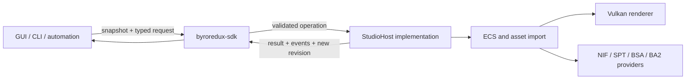

# ByroRedux SDK v0.1 development plan

Status: **Proposed**

Date: 2026-08-31

## 1. Outcome

Ship the first supported, useful release of `byroredux-sdk`: a Rust, in-process
tooling API that lets a host expose an imported asset as a document, lets any UI
or automation client inspect and edit that document through typed commands, and
can persist the authored overrides without owning rendering or Bethesda asset
IO.

The release is complete when a headless client and the existing `--studio` host
can both execute the same workflow:

1. Open an already imported NIF or SPT document through a host.
2. Enumerate stable document objects and inspect transforms and canonical PBR
   material values.
3. Select, transform, and edit a material through validated commands.
4. Undo and redo an edit group.
5. Save document overrides, reopen the source asset, and reapply those
   overrides deterministically.

This is the SDK's first compatibility promise, not a promise to expose the
entire engine.

## 2. Product definition

### 2.1 Intended users

- ByroRedux-owned tools such as Studio, command-line asset processors, and
  future validation or conversion tools.
- Third-party Rust tools embedded in the same process as a ByroRedux host.
- Automated tests that need a renderer-free document and command surface.

### 2.2 v0.1 scope

- Rust API only, distributed as the `byroredux-sdk` workspace crate.
- Renderer-, windowing-, UI-, archive-, and filesystem-independent contracts.
- A host-neutral document model, immutable snapshots, typed commands, command
  results, and structured errors.
- Stable document-local object identity, independent of ECS entity reuse.
- Transform and the existing canonical PBR material subset.
- Selection plus frame/pick requests as non-persistent viewport operations.
- Revision checks, edit grouping, undo, and redo.
- Versioned serialization of source identity and authored overrides.
- An ECS host adapter in `byroredux` and a renderer-free reference host used by
  tests and examples.
- Rustdoc, examples, compatibility policy, and an explicit experimental marker
  for anything outside the supported surface.

### 2.3 Non-goals

- A stable C ABI, C++ bindings, IPC protocol, or network service.
- A gameplay/modding SDK, Papyrus replacement, or WASM plugin API.
- Direct public access to `World`, Vulkan objects, renderer registries, archive
  readers, or egui callbacks.
- Editing meshes, skeletons, animations, collision, particles, terrain, cells,
  plugins, or native NIF/ESM records in v0.1.
- Baking edits back into NIF, SPT, BSA, BA2, ESM, ESP, or ESL files.
- Multi-user collaboration or merging concurrent edit histories.
- A claim of API stability beyond the documented v0.1 surface.

## 3. Current baseline

The initial prototype already establishes the right dependency direction:

- [`crates/sdk/src/studio.rs`](../../crates/sdk/src/studio.rs) owns bounds,
  Cornell-room fitting, snapshots, session state, picking, and typed commands.
- [`byroredux/src/studio_host.rs`](../../byroredux/src/studio_host.rs) translates
  snapshots and commands to ECS reads and mutations.
- [`crates/debug-ui/src/panels.rs`](../../crates/debug-ui/src/panels.rs) consumes
  snapshots and emits commands; it does not mutate the ECS directly.
- [`byroredux/src/scene.rs`](../../byroredux/src/scene.rs) imports the asset and
  creates the Studio session.

The prototype is not yet a release contract:

- Public identities are raw `EntityId` values, so persisted references are tied
  to one ECS lifetime.
- Commands return no success value or structured failure and cannot detect a
  stale client revision.
- View operations and persistent document edits share one command enum.
- Revision changes are not grouped into user-level edits.
- There is no undo/redo or persisted document format.
- Host-side validation is correct but duplicated outside the SDK contract.
- The only functional host is the full executable; there is no headless
  conformance implementation or external-usage example.

## 4. Architectural boundary



The arrows are deliberately one-way:

- `byroredux-sdk` may depend on small engine-neutral primitives. It must not
  depend on the renderer, debug UI, executable, archive providers, or OS IO.
- A host implements the SDK boundary and owns all ECS, IO, and GPU lifetimes.
- Clients see document-local IDs and value objects, never ECS guards or Vulkan
  handles.
- All mutation crosses one command dispatcher. UI-specific callbacks and CLI
  shortcuts translate to that same protocol.

### 4.1 Proposed public modules

| Module | Responsibility |
| --- | --- |
| `identity` | `DocumentId`, `ObjectId`, and source identity |
| `document` | Snapshots, object capabilities, values, and persisted overrides |
| `command` | Persistent edit commands, viewport requests, envelopes, results, and errors |
| `history` | Edit grouping plus bounded undo/redo semantics |
| `host` | The minimal trait implemented by a live or headless host |
| `studio` | Bounds, fitting, picking, and compatibility re-exports during migration |

### 4.2 Identity rule

`EntityId` must not cross the supported v0.1 boundary. Each imported document
assigns deterministic `ObjectId` values from stable import provenance (for
example source node/block identity plus a disambiguator), while the host keeps a
private `ObjectId <-> EntityId` map. Reloading an unchanged source must produce
the same IDs. If deterministic provenance is unavailable, the importer must
report that the object is transient and exclude it from persisted overrides.

### 4.3 Command rule

Persistent edits and viewport operations have different semantics and should
be distinct:

- `DocumentCommand`: transform and material edits, undo, and redo. Successful
  edits increment the document revision and may enter history.
- `ViewportRequest`: selection, pick-from-view, and frame-selection. These can
  change client/host view state but do not dirty the document.

Every persistent request carries an expected revision and optional edit-group
ID. Execution returns either a `CommandResult` containing the new revision and
change summary, or a typed `SdkError`. A stale revision never partially
applies.

### 4.4 Persistence rule

The SDK serializes a small, versioned document envelope, not imported engine
state:

```text
format_version
source identity + source fingerprint
object-id keyed transform overrides
object-id keyed material overrides
optional editor metadata
```

The host owns path resolution and byte IO. On reopen it imports the source,
checks its fingerprint, then asks the SDK to validate and apply overrides.
Unknown objects and source drift produce diagnostics; they are never silently
retargeted.

## 5. Delivery phases

Each phase should land as an independently reviewable change with tests and
documentation. Later phases depend on the acceptance gates of earlier phases.

### Phase 0 — contract and crate hygiene

Deliverables:

- Record the boundary and v0.1 scope in crate-level documentation.
- Add `#![forbid(unsafe_code)]` and require documentation on the supported
  public surface.
- Define the stability labels: `supported` for v0.1 and `experimental` for
  additive prototypes.
- Add package metadata needed for generated docs and eventual publication.
- Add a dependency gate proving the SDK does not acquire renderer, UI, archive,
  platform, or executable dependencies.

Exit gate:

- `cargo doc -p byroredux-sdk --no-deps` is warning-free.
- The allowed dependency list is explicit and checked in CI.

### Phase 1 — stable identities and snapshots

Deliverables:

- Introduce opaque `DocumentId` and `ObjectId` newtypes.
- Replace public `EntityId` fields in sessions, snapshots, commands, and picking
  results.
- Add object capabilities so clients can tell whether transform or material
  editing is supported without probing by failure.
- Move finite/range validation into SDK value constructors or validation
  methods; retain host-side defense in depth.
- Build and test the private mapping in `studio_host.rs`.
- Derive deterministic IDs for NIF and SPT Studio imports and define transient
  object behavior.

Exit gate:

- Reloading the same fixture produces byte-identical snapshots and IDs.
- No supported SDK type exposes `EntityId`.
- Invalid floats and out-of-range material values cannot reach an ECS write.

### Phase 2 — commands, results, and revision semantics

Deliverables:

- Split persistent `DocumentCommand` from `ViewportRequest`.
- Add `CommandEnvelope`, `CommandResult`, `Change`, and `SdkError`.
- Require an expected revision for persistent edits.
- Make command application atomic from the client's perspective.
- Define no-op behavior: a valid command that changes no value succeeds but does
  not advance revision or create history.
- Adapt debug UI and add a small CLI/example client using the same types.

Exit gate:

- Tests cover success, invalid object, unsupported capability, invalid value,
  stale revision, no-op, and host failure.
- UI code still performs no direct document mutation.

### Phase 3 — edit groups and undo/redo

Deliverables:

- Add explicit begin/update/commit or group-ID semantics so an egui drag creates
  one user-level history entry rather than one entry per frame.
- Store inverse changes using SDK values, not cloned ECS components.
- Implement bounded undo and redo with a host-configurable history capacity.
- Clear redo after a new committed edit and define revision behavior for undo
  and redo.
- Exclude selection, picking, and camera framing from persistent history.

Exit gate:

- A multi-update transform drag undoes in one step.
- Material and transform histories round-trip exactly within documented float
  semantics.
- Failed and no-op commands never enter history.

### Phase 4 — versioned document overrides

Deliverables:

- Add serde support behind a default-on `document-serde` feature or a clearly
  named companion module.
- Define format version 1 and a source fingerprint contract.
- Serialize only source identity, overrides, and optional editor metadata.
- Add structured load diagnostics for source mismatch, missing objects,
  unsupported properties, and newer format versions.
- Integrate open/save in Studio through host-owned filesystem operations.
- Add golden fixtures and deterministic serialization tests.

Exit gate:

- Save -> close -> reimport -> apply produces the same supported snapshot.
- Corrupt, non-finite, stale-source, and newer-version documents fail safely
  with actionable errors.
- SDK serialization performs no filesystem IO.

### Phase 5 — headless conformance and v0.1 release gate

Deliverables:

- Provide a renderer-free in-memory reference host or test harness.
- Publish one end-to-end example covering snapshot, edit, undo, redo, save, and
  reopen.
- Define a reusable host conformance suite and run it against both the
  in-memory host and the ECS adapter.
- Finish rustdoc examples, a migration note from the prototype API, and a v0.1
  compatibility statement.
- Add CI for SDK tests, docs, formatting, clippy, feature combinations, and
  minimal supported Rust version if the project elects to declare one.

Exit gate:

- The documented end-to-end workflow passes without Vulkan, a window, or game
  data.
- The same command fixtures pass against the ECS host.
- `--studio` retains its current transform/material/pick/frame behavior and adds
  undo/redo plus document save/open.

## 6. Verification matrix

| Layer | Required verification |
| --- | --- |
| Pure SDK | Identity determinism, validation, revision rules, change inversion, history bounds, serde golden tests |
| Reference host | Full workflow and host conformance suite with no renderer or filesystem |
| ECS adapter | Object-ID mapping, outsider rejection, atomic mutation, snapshot projection, source reload |
| Debug UI | Edit grouping, displayed errors, undo/redo state, no direct ECS mutation |
| Integration | Loose NIF, archive-backed NIF, and SPT Studio smoke paths |
| Compatibility | Old document fixture migration within v0.1; clear rejection of unsupported newer formats |

Commands expected at the final gate:

```bash
cargo test -p byroredux-sdk
cargo test -p byroredux studio
cargo test -p byroredux-debug-ui
cargo clippy -p byroredux-sdk --all-targets --all-features -- -D warnings
cargo doc -p byroredux-sdk --no-deps
```

## 7. Compatibility policy

- Before the v0.1 release tag, prototype names may change with a migration note.
- After v0.1, the documented supported Rust surface follows semver within the
  limits of a `0.x` crate: breaking changes require a minor version bump.
- The serialized document format has its own integer version and migration
  path; crate semver never substitutes for format versioning.
- Enum evolution must be planned deliberately. Persisted enums use explicit
  representations, and client-facing matches should have a documented
  forward-compatibility strategy.
- Experimental modules are excluded from the compatibility promise and marked
  in both rustdoc and type/module names.

## 8. Principal risks and controls

| Risk | Control |
| --- | --- |
| The SDK becomes a re-export of engine internals | Dependency gate, opaque IDs, value snapshots, and host traits |
| IDs drift after importer changes | Provenance-based ID fixtures and source fingerprint diagnostics |
| Undo captures partial ECS state | Atomic command adapter and conformance tests with injected failures |
| UI drag events flood history | Explicit edit groups with one commit boundary |
| Serialized projects become accidental native-asset formats | Persist overrides only; all import and native-file writes stay in the host |
| v0.1 expands into every engine subsystem | Limit editable capabilities to transform and canonical PBR material; add later domains only through separate proposals |
| Invalid numeric data reaches GPU-facing components | SDK validation plus host-side finite checks and clamping |

## 9. Deferred follow-ups

These are plausible v0.2+ tracks, not hidden v0.1 requirements:

- Hierarchy and multi-selection.
- Gizmo transactions and snapping.
- Animation, skeleton, collision, particle, and light inspectors.
- Asset browsing and asynchronous host operations.
- Import/export or conversion services.
- A reusable engine-host crate extracted from the executable.
- C ABI, IPC, Python, or other language bindings.
- Sandboxed plugin integration and a separate runtime/gameplay SDK.

## 10. First implementation slice

Begin with Phases 0 and 1 as one vertical slice:

1. Add the new ID/value/error modules without removing compatibility re-exports.
2. Introduce the private `ObjectId <-> EntityId` map in the existing ECS host.
3. Convert snapshots, selection, picking, and transform/material commands to
   `ObjectId`.
4. Add deterministic reload fixtures for one NIF and one synthetic SPT scene.
5. Migrate the debug UI, then remove the `EntityId`-based prototype surface.

This establishes the hardest boundary first. Command results, history, and
serialization then build on identities that are safe to expose and persist.
